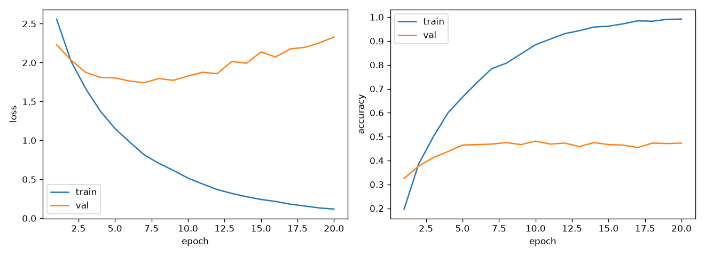
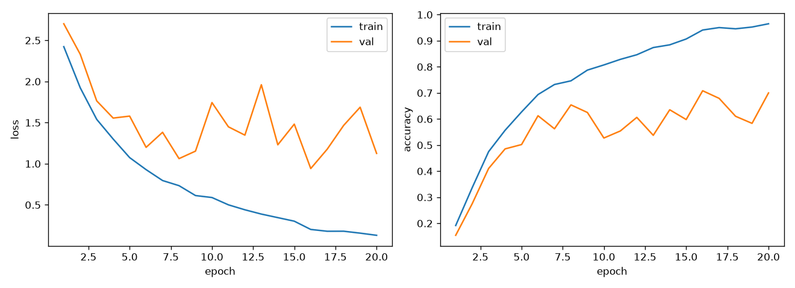
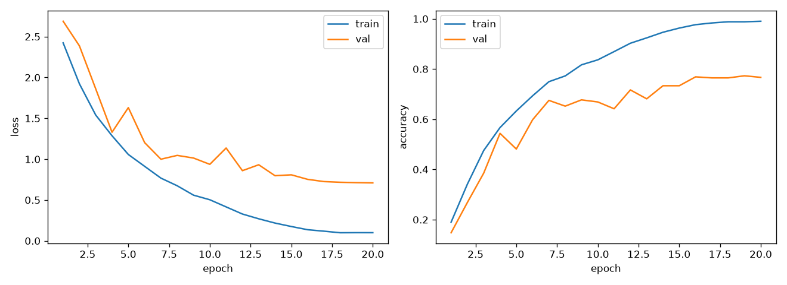

# Experiment Log

All numbers are on the fixed 20% validation split (seed 0, 480 images).
The test set is only evaluated once, on the final selected model.

## Dataset notes

- 16 classes, 150 train / 25 test images per class (balanced). `test2/` holds 400 unlabeled images.
- **Only the `Flower` class is in color.** 2,250 of 2,400 train images are grayscale (`L`); the 150 RGB
  images are all `Flower` (same in test: 25 RGB, all `Flower`). Color input therefore gives a shortcut
  for one class rather than general color information.
- Image sizes vary (292 distinct sizes); half are 256×256, most others ~220px tall.
- No duplicate files between train, test and test2 (MD5 check).

## Results summary

| # | Experiment | Config | What changed | Why | Val acc | Observation |
|---|---|---|---|---|---:|---|
| 0 | Baseline | `configs/baseline.yaml` | Starter TNet, grayscale 64×64, Adam 2e-3, 20 epochs | Sanity check / reference point | 48.1% | Heavy overfitting: train acc 99% vs val 47%; val loss rises after epoch 7. Weakest classes: InsideCity, Kitchen (20%), Industrial (31%). |
| 1 | Deeper CNN | `configs/step1_deeper_cnn.yaml` | 4 conv blocks (8 conv layers) + BatchNorm + global avg pool + dropout 0.3; training unchanged | One 3×3 layer can't see objects or layout | 70.8% | +22.7 pts. Val acc very unstable (53–71% from epoch 6 on; last-5-epoch mean 65.6%). Still overfits (train 97%). Indoor classes still weakest. |
| 2a | + Cosine LR | `configs/step2a_cosine.yaml` | LR decays from 0.002 to 0 over the run (cosine), stepped every batch | Step 1's val acc jumped ±15 pts between epochs | 77.3% | +6.5 pts best, +11.1 pts last-5 mean (65.6 → 76.8%). Val curve now smooth; last 5 epochs within 76.5–77.3%. Overfitting gap still large (train 99%). |

---

## Step 0 — Baseline (starter TNet)

**Goal.** Reproduce the course starter model exactly, inside our own config-driven pipeline, to get a
reference number that every later experiment is compared against. Nothing was tuned.

**Reproduce.**
```bash
python train.py --config configs/baseline.yaml
python evaluate.py --checkpoint runs/baseline/best.pt     # validation split
```
Outputs: `runs/baseline/{summary.json, history.json, curves.png, eval_val.json}`.

### Setup

| Item | Value |
|---|---|
| Data split | 2,400 train images → 1,920 train / 480 val. Random (not stratified) split from `torch.randperm` with seed 0, the same split as the starter notebook's `random_split`. |
| Preprocessing | Convert to grayscale (1 channel) → resize to 64×64 (aspect ratio not kept) → tensor → normalize with mean 0.5, std 0.5 (range [-1, 1]) |
| Augmentation | None |
| Model | `TNet` ([src/models.py](src/models.py)) |
| Loss | Cross-entropy |
| Optimizer | Adam, lr 0.002, no weight decay, no LR schedule |
| Batch size / epochs | 64 / 20 (30 iterations per epoch) |
| Model selection | After every epoch, evaluate on val; keep the weights from the epoch with the highest val accuracy |
| Seed / hardware | Seed 0; Apple Silicon GPU (MPS), PyTorch 2.14.1, torchvision 0.29.1 |
| Training time | 9.9 s total |

### Architecture and parameter count

| Layer | Output shape | Parameters |
|---|---|---:|
| Input (grayscale) | 1 × 64 × 64 | – |
| Conv2d 3×3, 16 filters, no padding | 16 × 62 × 62 | 1·16·3·3 + 16 = **160** |
| ReLU | 16 × 62 × 62 | 0 |
| MaxPool 4×4, stride 4 | 16 × 15 × 15 | 0 |
| Flatten | 3,600 | 0 |
| Linear 3,600 → 16 | 16 | 3,600·16 + 16 = **57,616** |
| **Total** | | **57,776** |

The model has only one convolutional layer, so it sees 3×3 patterns and nothing larger. Almost all of
its parameters (99.7%) are in the final linear layer, which effectively memorizes where those small
patterns appear in each image.

### How the baseline number is calculated

Validation accuracy = (validation images whose highest-scoring class equals the true label) ÷ 480.
For each image the model outputs 16 scores, and the predicted class is the one with the highest score.

- The best epoch was **epoch 10**, with **231 / 480 correct = 0.48125 → 48.1%**.
- Chance level for 16 balanced classes is 1/16 = 6.25%, so the pipeline is clearly learning.
- The handout says the starter gets "less than approximately 50%", which this matches.

Note: the epoch is chosen on the same validation set we report, so 48.1% is slightly optimistic. The
same rule is used for every experiment, so comparisons between them remain fair.

### Training curve

| Epoch | Train loss | Train acc | Val loss | Val acc |
|---:|---:|---:|---:|---:|
| 1 | 2.559 | 19.7% | 2.229 | 32.5% |
| 3 | 1.664 | 50.0% | 1.873 | 41.3% |
| 5 | 1.153 | 66.5% | 1.804 | 46.5% |
| 7 | 0.815 | 78.4% | **1.742** (lowest) | 46.9% |
| **10** | 0.516 | 88.4% | 1.827 | **48.1%** (best) |
| 15 | 0.241 | 96.2% | 2.137 | 46.7% |
| 20 | 0.118 | 99.2% | 2.329 | 47.3% |



### Per-class validation accuracy (best checkpoint)

The val split is random rather than stratified, so classes have 24–39 val images each.

| Class | Correct / total | Acc | Most confused with |
|---|---:|---:|---|
| InsideCity | 6 / 30 | 20.0% | Store (8) |
| Kitchen | 6 / 30 | 20.0% | InsideCity (4) |
| Industrial | 9 / 29 | 31.0% | Bedroom (6) |
| Forest | 11 / 29 | 37.9% | TallBuilding (4) |
| LivingRoom | 10 / 26 | 38.5% | Kitchen (5) |
| Bedroom | 16 / 39 | 41.0% | LivingRoom (7) |
| Store | 14 / 31 | 45.2% | InsideCity (6) |
| Flower | 15 / 31 | 48.4% | Store (5) |
| Mountain | 14 / 28 | 50.0% | OpenCountry (4) |
| Office | 12 / 24 | 50.0% | LivingRoom (3) |
| OpenCountry | 14 / 28 | 50.0% | Coast (7) |
| Highway | 16 / 28 | 57.1% | Coast (5) |
| Suburb | 21 / 34 | 61.8% | Mountain (4) |
| Coast | 22 / 33 | 66.7% | OpenCountry (7) |
| TallBuilding | 19 / 28 | 67.9% | Industrial (3) |
| Street | 26 / 32 | 81.2% | Bedroom (1) |

### Observations

1. **Severe overfitting.** Training accuracy climbs to 99% while validation stays around 47%. Validation
   loss is lowest at epoch 7 and then rises steadily, so after that point the model is memorizing the
   1,920 training images rather than learning general features.
2. **The model is too shallow, so it can't be called underfit or well fit.** One 3×3 conv layer can only
   detect edges and small textures. The confusions match this: classes that differ in layout but share
   textures get mixed up (indoor scenes Bedroom/LivingRoom/Kitchen; outdoor Coast/OpenCountry/Mountain;
   InsideCity/Store).
3. **Classes with distinctive structure do best.** Street (81%) and TallBuilding (68%) have strong,
   consistent lines; the cluttered indoor classes do worst.
4. **Flower gets only 48%** even though it is the only color class, because the baseline converts every
   image to grayscale and throws that information away (see Dataset notes).
5. **Low resolution.** 64×64 removes most fine detail, which matters for indoor scenes defined by
   objects (stove, bed, shelves).

### What this suggests for the next step

- Add more conv layers with padding and BatchNorm, so the model learns larger patterns (objects, layout)
  instead of memorizing positions in a large linear layer → **Step 1**.
- Fight overfitting with augmentation and regularization → **Step 2**.
- Revisit resolution (64 → 128) and the gray-vs-color question in later steps.

---

## Step 1 — Deeper CNN from scratch

**Question.** Step 0 showed that a single 3×3 conv layer can only see edges and textures, and that 99.7%
of its parameters sit in one linear layer that memorizes positions. Does a proper multi-layer CNN, which
can build up from edges to parts to objects and layout, do much better on the same data?

**Controlled change.** Only the architecture changed. Data, preprocessing (grayscale 64×64, no
augmentation), optimizer (Adam 0.002), batch size (64), epochs (20), seed and split are identical to Step 0.

**Reproduce.**
```bash
python train.py --config configs/step1_deeper_cnn.yaml
python evaluate.py --checkpoint runs/step1_deeper_cnn/best.pt
```

### Architecture: `SceneCNN` ([src/models.py](src/models.py))

Each block = Conv3×3 → BatchNorm → ReLU → Conv3×3 → BatchNorm → ReLU → MaxPool 2×2.
Padding 1 keeps the size inside a block; the pool halves it.

| Stage | Output shape (64px input) | Parameters |
|---|---|---:|
| Input (grayscale) | 1 × 64 × 64 | – |
| Block 1 (1 → 32) | 32 × 32 × 32 | 9,632 |
| Block 2 (32 → 64) | 64 × 16 × 16 | 55,552 |
| Block 3 (64 → 128) | 128 × 8 × 8 | 221,696 |
| Block 4 (128 → 256) | 256 × 4 × 4 | 885,760 |
| Global average pool | 256 | 0 |
| Dropout 0.3 → Linear 256 → 16 | 16 | 4,112 |
| **Total** | | **1,176,752** |

Design choices and why:
- **8 conv layers instead of 1.** After 4 blocks each output unit sees most of the 64×64 image, so the
  network can respond to whole objects and scene layout, not only local texture.
- **BatchNorm.** Keeps activations well scaled so an 8-layer network trains quickly with the same Adam
  learning rate as the baseline.
- **Global average pooling instead of flattening.** The baseline's 57,600-weight linear layer memorized
  *where* features occurred. Averaging over space forces the network to describe *what* is in the scene,
  and shrinks the head to 4,112 parameters (0.3% of the model, vs 99.7% in TNet).
- **Dropout 0.3** before the classifier, as light regularization.

The model has 20× more parameters than TNet, but they are almost all in conv filters shared across the
image rather than in a position-specific linear layer.

### Result

- Best epoch **16**: **340 / 480 correct = 70.8%** validation accuracy (Step 0: 231 / 480 = 48.1%).
- **+22.7 percentage points** from architecture alone. Training took 31.6 s on MPS (Step 0: 9.9 s).

| Epoch | Train loss | Train acc | Val loss | Val acc |
|---:|---:|---:|---:|---:|
| 1 | 2.423 | 19.2% | 2.702 | 15.4% |
| 4 | 1.300 | 55.7% | 1.555 | 48.5% |
| 6 | 0.928 | 69.4% | 1.199 | 61.3% |
| 8 | 0.734 | 74.6% | 1.062 | 65.4% |
| 10 | 0.590 | 80.7% | 1.744 | 52.7% |
| 13 | 0.388 | 87.4% | 1.961 | 53.8% |
| **16** | 0.202 | 94.1% | **0.942** | **70.8%** (best) |
| 19 | 0.157 | 95.3% | 1.687 | 58.3% |
| 20 | 0.130 | 96.5% | 1.126 | 70.0% |



### Per-class validation accuracy (best checkpoint)

| Class | Step 0 | Step 1 | Change | Most confused with (Step 1) |
|---|---:|---:|---:|---|
| Bedroom | 41.0% | 46.2% (18/39) | +5.2 | LivingRoom (14) |
| Kitchen | 20.0% | 50.0% (15/30) | +30.0 | Office (7) |
| InsideCity | 20.0% | 53.3% (16/30) | +33.3 | Office (5) |
| Industrial | 31.0% | 58.6% (17/29) | +27.6 | Store (4) |
| Street | 81.2% | 62.5% (20/32) | −18.7 | Highway (5) |
| OpenCountry | 50.0% | 64.3% (18/28) | +14.3 | Mountain (4) |
| LivingRoom | 38.5% | 69.2% (18/26) | +30.7 | Office (5) |
| Coast | 66.7% | 69.7% (23/33) | +3.0 | OpenCountry (8) |
| Highway | 57.1% | 75.0% (21/28) | +17.9 | Coast (5) |
| TallBuilding | 67.9% | 75.0% (21/28) | +7.1 | Office (4) |
| Flower | 48.4% | 80.6% (25/31) | +32.2 | Mountain (3) |
| Store | 45.2% | 80.6% (25/31) | +35.4 | InsideCity (2) |
| Office | 50.0% | 83.3% (20/24) | +33.3 | Bedroom (1) |
| Mountain | 50.0% | 89.3% (25/28) | +39.3 | Coast (1) |
| Forest | 37.9% | 89.7% (26/29) | +51.8 | Flower (1) |
| Suburb | 61.8% | 94.1% (32/34) | +32.3 | LivingRoom (1) |

### Observations

1. **Depth was the main bottleneck.** 15 of 16 classes improved, most by 25–50 points. The biggest gains
   are texture-heavy classes (Forest +52, Mountain +39) and object-defined classes (Store +35, Office +33),
   which need more than one 3×3 layer to recognize.
2. **Validation accuracy is very unstable.** From epoch 6 on it jumps between 52.7% and 70.8%, sometimes by
   15 points between consecutive epochs (epoch 9 → 10: 62.5% → 52.7%). The last-5-epoch mean is only
   **65.6%**, so the 70.8% best epoch is partly a lucky peak. Likely causes: a constant, fairly high
   learning rate (0.002, no decay) keeps the weights moving, and BatchNorm statistics from a small
   dataset shift between epochs.
3. **Still overfitting.** Training accuracy reaches 96.5% while validation averages ~66%. The gap is smaller
   than in Step 0 (99% vs 47%), but the model is still memorizing: without augmentation it sees exactly the
   same 1,920 images every epoch.
4. **Indoor scenes remain hardest.** Bedroom (46%), Kitchen (50%) and InsideCity (53%) are the weakest
   classes. Bedroom is mistaken for LivingRoom 14 times (vs 18 correct). These
   classes share furniture and are separated mostly by specific objects, which 64×64 grayscale images make
   hard to see.
5. **Street got worse (81% → 63%),** mostly mistaken for Highway. Both are roads with strong perspective
   lines. The baseline may have matched Street on simple line patterns; the deeper model looks at overall
   layout, where the two classes are similar.

### What this suggests for the next step

- **Step 2: augmentation**, to reduce overfitting by showing the model new variations of the 1,920 images
  every epoch.
- **Add a learning-rate schedule** (e.g. cosine decay), so the weights settle at the end of training
  instead of jumping around. This should make validation accuracy more stable and the best-epoch number
  more trustworthy. Since it is a separate change from augmentation, it should be tested on its own.

---

## Step 2a — Cosine learning-rate schedule

**Question.** In Step 1, validation accuracy jumped by up to 15 points between consecutive epochs, so the
"best epoch" (70.8%) was partly luck. Our hypothesis: with a constant learning rate of 0.002 the weights
never settle, they keep bouncing around a good solution. Does decaying the learning rate fix this?

**Controlled change.** Only the learning-rate schedule changed. Architecture, data, optimizer, initial LR,
batch size, epochs, seed and split are identical to Step 1 (the two config files differ by one line).

**Reproduce.**
```bash
python train.py --config configs/step2a_cosine.yaml
python evaluate.py --checkpoint runs/step2a_cosine/best.pt
```

### What cosine decay does

The learning rate starts at 0.002 and follows half a cosine curve down to 0 by the last batch:
`lr(t) = 0.002 · ½ · (1 + cos(π · t / T))`, where `t` is the current batch and `T` = 20 epochs × 30
batches = 600 batches. It is updated after every batch (code: `build_scheduler` in
[src/engine.py](src/engine.py)). Early epochs keep a high LR to learn quickly; late epochs take very small
steps so the model settles into a minimum instead of jumping around it.

LR at the start of each epoch (also saved in `history.json`):

| Epoch | 1 | 5 | 10 | 11 | 15 | 18 | 20 |
|---|---|---|---|---|---|---|---|
| LR | 0.00200 | 0.00181 | 0.00116 | 0.00100 | 0.00041 | 0.00011 | 0.00001 |

### Result

- Best epoch **19**: **371 / 480 correct = 77.3%** validation accuracy (Step 1: 340 / 480 = 70.8%).
- **+6.5 points** at the best epoch, and **+11.1 points** on the more honest last-5-epoch mean
  (Step 1: 65.6% → Step 2a: 76.8%). Training time unchanged (30.6 s).

| Epoch | Train loss | Train acc | Val loss | Val acc |
|---:|---:|---:|---:|---:|
| 1 | 2.423 | 19.0% | 2.688 | 14.8% |
| 4 | 1.286 | 56.7% | 1.330 | 54.4% |
| 7 | 0.768 | 75.0% | 0.999 | 67.5% |
| 10 | 0.503 | 83.7% | 0.937 | 66.9% |
| 12 | 0.328 | 90.3% | 0.859 | 71.7% |
| 14 | 0.218 | 94.6% | 0.797 | 73.3% |
| 16 | 0.136 | 97.7% | 0.753 | 76.9% |
| **19** | 0.100 | 98.8% | 0.712 | **77.3%** (best) |
| 20 | 0.100 | 99.0% | **0.709** (lowest) | 76.7% |



**Stability, Step 1 vs Step 2a** (validation accuracy, epochs 6–20):

| | Step 1 (constant LR) | Step 2a (cosine) |
|---|---:|---:|
| Range, epochs 6–20 | 52.7% – 70.8% | 59.8% – 77.3% |
| Range, last 5 epochs | 58.3% – 70.8% | 76.5% – 77.3% |
| Mean, last 5 epochs | 65.6% | 76.8% |
| Lowest val loss | 0.942 | 0.709 |

### Per-class validation accuracy (best checkpoint)

Each val class has only 24–39 images, so one image is worth ~3 points. Changes of under ~7 points
(1–2 images) should be treated as noise.

| Class | Step 1 | Step 2a | Change | Most confused with (Step 2a) |
|---|---:|---:|---:|---|
| Bedroom | 46.2% | 53.8% (21/39) | +7.7 | LivingRoom (14) |
| LivingRoom | 69.2% | 57.7% (15/26) | −11.5 | Kitchen (4) |
| Industrial | 58.6% | 62.1% (18/29) | +3.4 | Store (4) |
| OpenCountry | 64.3% | 71.4% (20/28) | +7.1 | Coast (3) |
| Kitchen | 50.0% | 73.3% (22/30) | +23.3 | LivingRoom (5) |
| Highway | 75.0% | 75.0% (21/28) | 0.0 | Coast (3) |
| Coast | 69.7% | 75.8% (25/33) | +6.1 | OpenCountry (7) |
| InsideCity | 53.3% | 76.7% (23/30) | +23.3 | Industrial (3) |
| Office | 83.3% | 79.2% (19/24) | −4.2 | LivingRoom (2) |
| Store | 80.6% | 80.6% (25/31) | 0.0 | InsideCity (2) |
| Forest | 89.7% | 82.8% (24/29) | −6.9 | Flower (2) |
| TallBuilding | 75.0% | 85.7% (24/28) | +10.7 | Industrial (2) |
| Street | 62.5% | 87.5% (28/32) | +25.0 | Bedroom (1) |
| Mountain | 89.3% | 89.3% (25/28) | 0.0 | Flower (1) |
| Flower | 80.6% | 90.3% (28/31) | +9.7 | Bedroom (1) |
| Suburb | 94.1% | 97.1% (33/34) | +2.9 | InsideCity (1) |

### Observations

1. **The hypothesis held: the instability came from the constant LR.** In the last 5 epochs, validation
   accuracy now stays within 0.8 points (76.5–77.3%), compared with a 12.5-point range in Step 1. The
   best-epoch number is no longer a lucky spike; it is close to where training actually ends.
2. **Better, not just more stable.** The last-5 mean rose 11.1 points and validation loss fell from 0.94
   to 0.71. Small final steps let the model settle in a better minimum than constant-LR training reached.
3. **Overfitting is now the clear bottleneck.** Training accuracy reaches 99.0% (loss 0.10) while
   validation is 77%. With a stable optimizer the remaining 22-point gap is a generalization problem,
   not an optimization one: the model has memorized the 1,920 training images.
4. **Step 1's two biggest regressions recovered.** Street went from 62.5% back to 87.5%, and
   InsideCity/Kitchen each gained 23 points. Part of Step 1's per-class picture was noise from evaluating
   an unsettled model.
5. **Bedroom vs LivingRoom is still the hardest pair.** Bedroom is mistaken for LivingRoom 14 times
   (21 correct). LivingRoom dropping to 57.7% is 3 images, within noise, but the two classes clearly
   share features the model can't separate at 64×64 grayscale.

### What this suggests for the next step

Keep the cosine schedule from now on. The model now fits the training set almost perfectly while
validation stays at 77%, so the next lever is **data augmentation (Step 2b)**: show the network a
different random variant of each image every epoch so it cannot simply memorize them.
