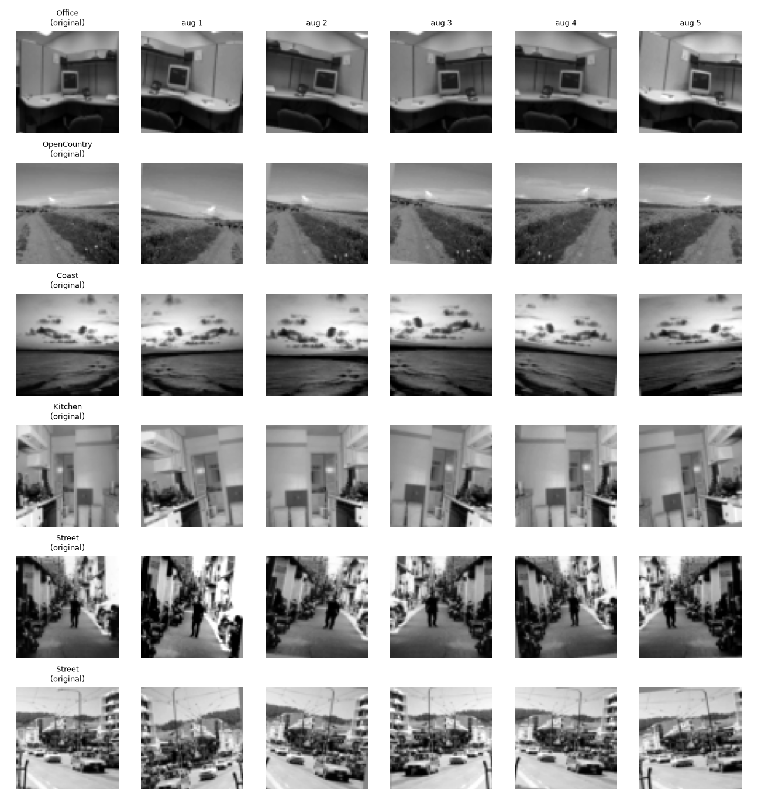
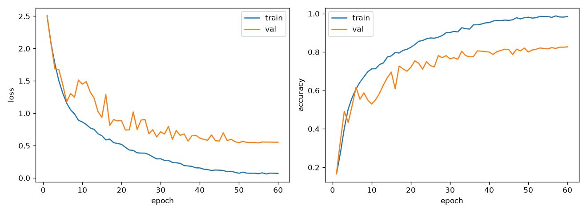
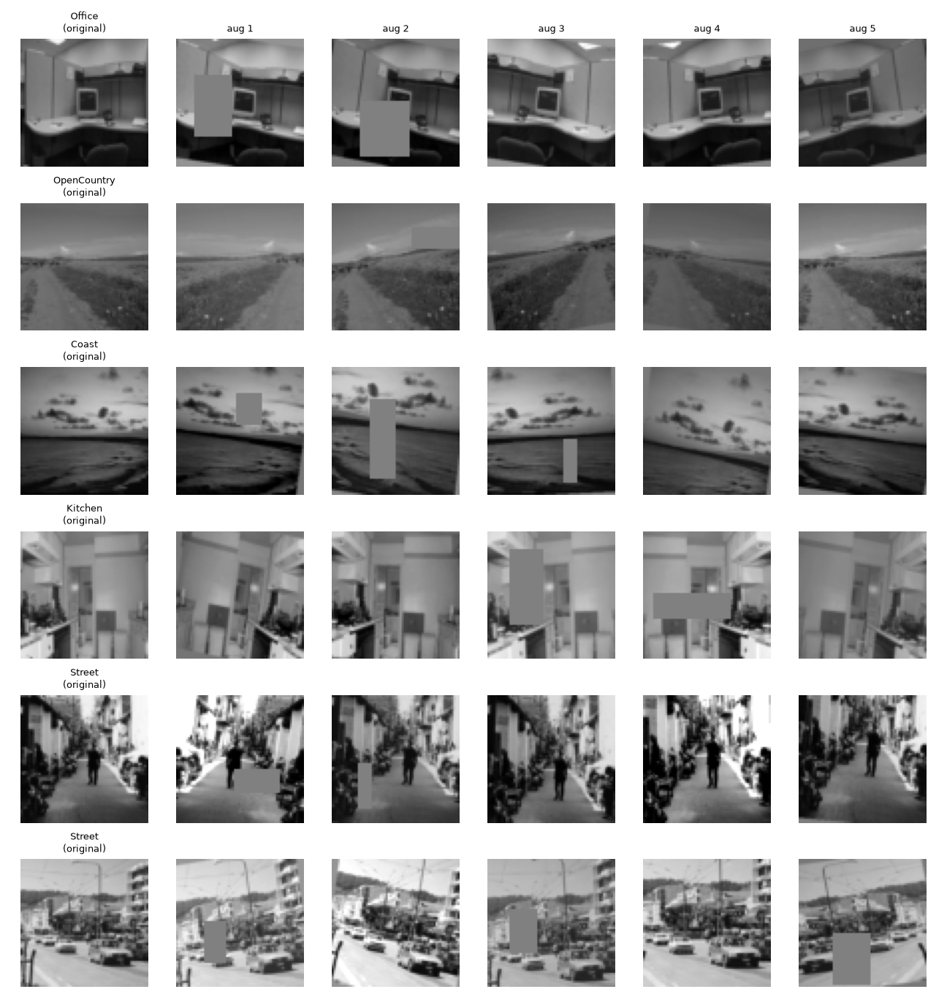
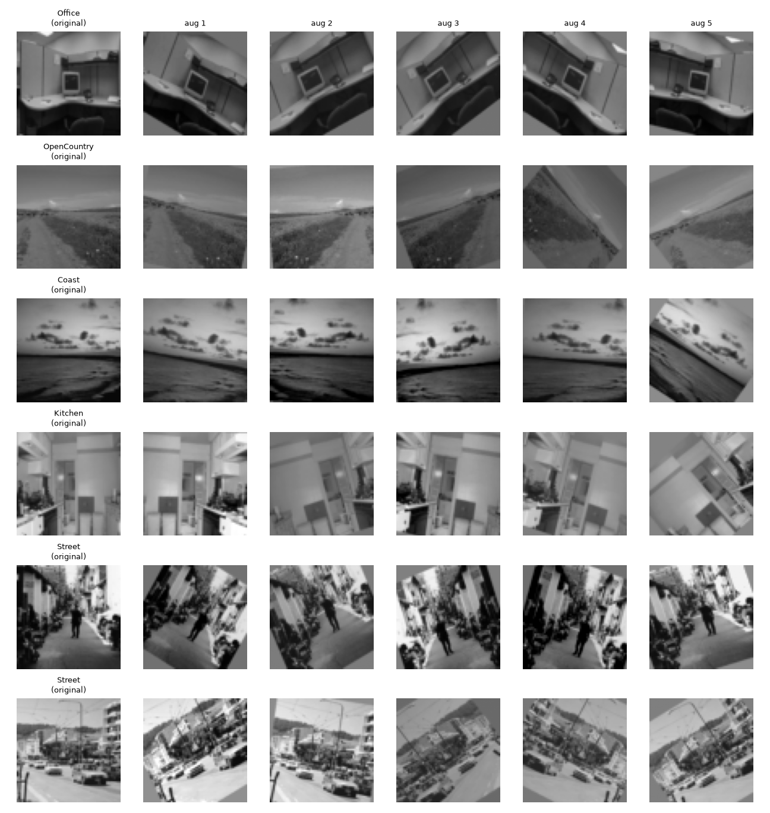
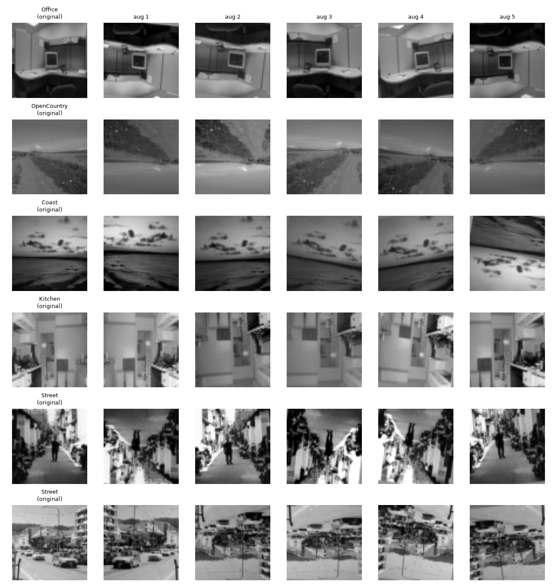
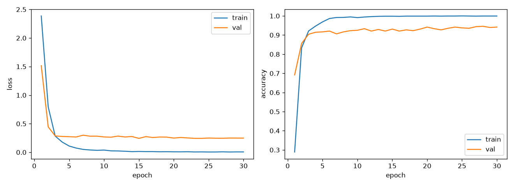
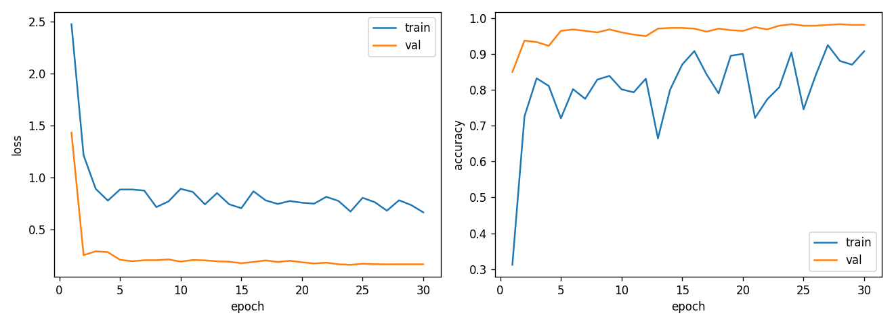

# Experiment Log

All numbers are on the fixed 20% validation split (seed 0, 480 images).
The test set is only evaluated once, on the final selected model.

## Dataset notes

- 16 classes, 150 train / 25 test images per class (balanced). `test2/` holds 400 unlabeled images.
- **Only the `Flower` class is in color.** 2,250 of 2,400 train images are grayscale (`L`); the 150 RGB
  images are all `Flower` (same in test: 25 RGB, all `Flower`). Color input therefore gives a shortcut
  for one class rather than general color information.
- Image sizes vary (292 distinct sizes); half are 256×256, most others ~220px tall.
- No duplicate files between train, test and test2 (MD5 check).

## Progress at a glance

Best configuration at each stage (validation accuracy; mean of 3 seeds where 3 seeds were run).

| Step | What changed | Val acc | Gain |
|---|---|---:|---:|
| 0 | Starter TNet (1 conv layer, gray 64px) | 48.1% | — |
| 1 | Deeper CNN (8 conv layers + BatchNorm) | 70.8% | +22.7 |
| 2a | + Cosine learning-rate decay | 77.3% | +6.5 |
| 2b-ii | + Augmentation and 60 epochs | 82.8% | +5.5 |
| 3b | 128px input (best from scratch) | 84.7% | +1.9 |
| 4a | ImageNet-pretrained ResNet-18, frozen | 91.7% | +7.0 |
| 4b | ResNet-18, fully fine-tuned | 94.4% | +2.7 |
| 5a | ConvNeXt-Tiny backbone | 96.8% | +2.7* |
| 5b | ConvNeXt V2-Tiny (FCMAE pretraining) | 97.2% | +0.3 |
| 5c-ii | + Label smoothing + Mixup/CutMix | **97.5%** | +0.3 |

\*Compared with the ResNet-18 control on the same A100 (94.1%). Gains from 5b onward are within seed noise.

What did not help: Cutout (2c), large rotation / vertical flip (2d, −2.5 to −4.7), RGB input (3a, a
Flower-only shortcut), a 4× wider network (3c), label smoothing alone (5c-i), flip TTA (5d).

## Results summary

| # | Experiment | Config | What changed | Why | Val acc | Observation |
|---|---|---|---|---|---:|---|
| 0 | Baseline | `configs/baseline.yaml` | Starter TNet, grayscale 64×64, Adam 2e-3, 20 epochs | Sanity check / reference point | 48.1% | Heavy overfitting: train acc 99% vs val 47%; val loss rises after epoch 7. Weakest classes: InsideCity, Kitchen (20%), Industrial (31%). |
| 1 | Deeper CNN | `configs/step1_deeper_cnn.yaml` | 4 conv blocks (8 conv layers) + BatchNorm + global avg pool + dropout 0.3; training unchanged | One 3×3 layer can't see objects or layout | 70.8% | +22.7 pts. Val acc very unstable (53–71% from epoch 6 on; last-5-epoch mean 65.6%). Still overfits (train 97%). Indoor classes still weakest. |
| 2a | + Cosine LR | `configs/step2a_cosine.yaml` | LR decays from 0.002 to 0 over the run (cosine), stepped every batch | Step 1's val acc jumped ±15 pts between epochs | 77.3% | +6.5 pts best, +11.1 pts last-5 mean (65.6 → 76.8%). Val curve now smooth; last 5 epochs within 76.5–77.3%. Overfitting gap still large (train 99%). |
| 2b-i | + Augmentation | `configs/step2b_augment.yaml` | Random resized crop, h-flip, ±10° rotation, brightness/contrast (train only); 20 epochs | Step 2a memorizes the train set (99% train vs 77% val) | 76.5% | −0.8 pts (noise). Train/val gap shrank 22 → 9 pts, but the model is now under-trained (train 86%). |
| 2b ctrl | Longer training, no aug | `configs/step2a_cosine_60ep.yaml` | Step 2a with 60 epochs | Control: separate "augmentation" from "more epochs" | 79.0% | Last-5 mean +1.5 pts only. Reaches 100% train acc / loss 0.002 — pure memorization; val loss 0.84. |
| 2b-ii | + Augmentation, 60 epochs | `configs/step2b_augment_60ep.yaml` | Step 2b-i with 60 epochs | Augmented data needs more epochs to fit | **82.7%** | +5.4 pts vs 2a; +4.1 pts last-5 mean vs the 60-epoch control. Val loss 0.55 (best so far). Augmentation and longer training only help together. |
| 2c | + Cutout | `configs/step2c_cutout.yaml` | Random Erasing (p 0.5, 2–20% of area) on top of 2b-ii; **3 seeds each** | Force the model to use the whole scene, not one object | 83.1% ± 1.0 (3 seeds) | **No real effect**: 2b-ii is 82.8% ± 0.3. Last-5 means identical (82.1 vs 82.2%). Single seeds pointed both ways (−0.4 to +1.7 pts). Lower train acc and val loss, so it regularizes, but accuracy doesn't move. |
| 2d-i | Large rotation (planned failure) | `configs/step2d_rot45.yaml` | Rotation ±45° instead of ±10°; 3 seeds | Scenes have a fixed "up"; should hurt | 78.1% ± 1.7 | **−4.7 pts.** Hurts most on man-made scenes with straight vertical/horizontal lines (Industrial −15, InsideCity −13, Store −12). Flower *gains* +10. |
| 2d-ii | Vertical flip (planned failure) | `configs/step2d_vflip.yaml` | + vertical flip p 0.5; 3 seeds | Upside-down scenes never occur at test time | 80.3% ± 0.6 | **−2.5 pts.** Hurts classes defined by sky-above-ground layout (TallBuilding −8, Coast −8). Line-based classes unaffected. |
| 3a | RGB input | `configs/step3a_rgb.yaml` | 3-channel color input instead of grayscale; 3 seeds | Does color help? Only Flower is in color | 84.2% ± 1.9 | +1.4 but noisy. **Shortcut confirmed:** with color stripped at eval time, Flower drops 89% → 22% (gray model: 82%). The model learned "color = Flower". |
| 3b | 128×128 input | `configs/step3b_res128.yaml` | Resolution 64 → 128, same network; 3 seeds | Finer detail for object-defined scenes | **84.7% ± 0.7** | **+1.9**, every seed above every 64px seed. Biggest gains: Flower +13, Kitchen +8, OpenCountry +6. Costs 3.6× training time. |
| 3c | 2× wider network | `configs/step3c_wide.yaml` | Channels 64-128-256-512 (4.7M params, 4×); 3 seeds | Is model capacity the limit? | 83.0% ± 0.3 | **No gain** (+0.2) for 4× parameters and 2.7× time. Capacity isn't the bottleneck; the amount of data is. |
| 4a | Pretrained ResNet-18, frozen | `configs/step4a_resnet18_frozen.yaml` | ImageNet ResNet-18, only new final layer trained (8,208 weights); 224px, gray→3ch, AdamW; 3 seeds | How good are ImageNet features for scenes as-is? | 91.7% ± 0.6 | **+7.0 pts over the best from-scratch model** while training 0.07% of the weights. Flower 100% without color. |
| 4b | Pretrained ResNet-18, full fine-tune | `configs/step4b_resnet18_finetune.yaml` | All 11.2M weights trained; backbone LR 1e-4, head LR 1e-3, 2-epoch warm-up; 3 seeds | Does adapting the features add more? | **94.4% ± 0.2** | **+2.7 pts over frozen**, most stable result so far. Remaining errors: Bedroom↔LivingRoom, Coast↔OpenCountry, InsideCity↔Industrial/Street. |
| 5 ctrl | ResNet-18 4b on the A100 | `configs/step5_ctrl_resnet18_cuda.yaml` | Step 4b re-run unchanged on Colab A100 (CUDA); 3 seeds | Step 5 runs on different hardware than Steps 0–4 | 94.1% ± 0.1 | Matches the Mac result (94.4% ± 0.2) within noise → hardware doesn't change results; Step 5 compares against this. |
| 5a | ConvNeXt-Tiny | `configs/step5a_convnext_tiny.yaml` | ResNet-18 → ConvNeXt-Tiny (28M, supervised ImageNet-1k); recipe unchanged; 3 seeds | Stronger modern CNN backbone | 96.8% ± 0.1 | **+2.7 pts over ResNet-18**, the only clear gain in Step 5. Errors 28 → 15 per seed. |
| 5b | ConvNeXt V2-Tiny (FCMAE) | `configs/step5b_convnextv2_tiny.yaml` | Same architecture family, FCMAE masked-autoencoder + supervised weights; 3 seeds | Does masked-image pretraining transfer better? | 97.2% ± 0.6 | +0.3 over 5a, **within seed noise** (one seed 96.5%). Lowest val loss of all (0.109). |
| 5c-i | + Label smoothing | `configs/step5c1_label_smoothing.yaml` | 5b + label smoothing 0.1; 3 seeds | Less over-confidence on look-alike classes | 96.9% ± 0.2 | No gain (−0.3, noise). |
| 5c-ii | + LS + Mixup/CutMix | `configs/step5c2_ls_mix.yaml` | 5b + LS 0.1 + Mixup(α 0.2)/CutMix(α 1.0) on 50% of batches; 3 seeds | Blend images/labels to regularize confused pairs | **97.5% ± 0.8** | Best mean and best single run (98.3%), but seeds vary 96.7–98.3%. OpenCountry +6, Forest −5. |
| 5d | Horizontal-flip TTA | `evaluate.py --tta` on every Step 5 run | Average predictions of image + mirror | Free test-time gain? | — | **Slightly hurts** every ConvNeXt (−0.1 to −0.4); the models are already flip-invariant from training. |

---

## Step 0 — Baseline (starter TNet)

**Goal.** Reproduce the course starter model exactly, inside our own config-driven pipeline, to get a
reference number that every later experiment is compared against. Nothing was tuned.

**Reproduce.**
```bash
python train.py --config configs/baseline.yaml
python evaluate.py --checkpoint runs/baseline/best.pt     # validation split
```
Outputs: `runs/baseline/{summary.json, history.json, curves.png, eval_val.json}`.

### Setup

| Item | Value |
|---|---|
| Data split | 2,400 train images → 1,920 train / 480 val. Random (not stratified) split from `torch.randperm` with seed 0, the same split as the starter notebook's `random_split`. |
| Preprocessing | Convert to grayscale (1 channel) → resize to 64×64 (aspect ratio not kept) → tensor → normalize with mean 0.5, std 0.5 (range [-1, 1]) |
| Augmentation | None |
| Model | `TNet` ([src/models.py](src/models.py)) |
| Loss | Cross-entropy |
| Optimizer | Adam, lr 0.002, no weight decay, no LR schedule |
| Batch size / epochs | 64 / 20 (30 iterations per epoch) |
| Model selection | After every epoch, evaluate on val; keep the weights from the epoch with the highest val accuracy |
| Seed / hardware | Seed 0; Apple Silicon GPU (MPS), PyTorch 2.14.1, torchvision 0.29.1 |
| Training time | 9.9 s total |

### Architecture and parameter count

| Layer | Output shape | Parameters |
|---|---|---:|
| Input (grayscale) | 1 × 64 × 64 | – |
| Conv2d 3×3, 16 filters, no padding | 16 × 62 × 62 | 1·16·3·3 + 16 = **160** |
| ReLU | 16 × 62 × 62 | 0 |
| MaxPool 4×4, stride 4 | 16 × 15 × 15 | 0 |
| Flatten | 3,600 | 0 |
| Linear 3,600 → 16 | 16 | 3,600·16 + 16 = **57,616** |
| **Total** | | **57,776** |

The model has only one convolutional layer, so it sees 3×3 patterns and nothing larger. Almost all of
its parameters (99.7%) are in the final linear layer, which effectively memorizes where those small
patterns appear in each image.

### How the baseline number is calculated

Validation accuracy = (validation images whose highest-scoring class equals the true label) ÷ 480.
For each image the model outputs 16 scores, and the predicted class is the one with the highest score.

- The best epoch was **epoch 10**, with **231 / 480 correct = 0.48125 → 48.1%**.
- Chance level for 16 balanced classes is 1/16 = 6.25%, so the pipeline is clearly learning.
- The handout says the starter gets "less than approximately 50%", which this matches.

Note: the epoch is chosen on the same validation set we report, so 48.1% is slightly optimistic. The
same rule is used for every experiment, so comparisons between them remain fair.

### Training curve

| Epoch | Train loss | Train acc | Val loss | Val acc |
|---:|---:|---:|---:|---:|
| 1 | 2.559 | 19.7% | 2.229 | 32.5% |
| 3 | 1.664 | 50.0% | 1.873 | 41.3% |
| 5 | 1.153 | 66.5% | 1.804 | 46.5% |
| 7 | 0.815 | 78.4% | **1.742** (lowest) | 46.9% |
| **10** | 0.516 | 88.4% | 1.827 | **48.1%** (best) |
| 15 | 0.241 | 96.2% | 2.137 | 46.7% |
| 20 | 0.118 | 99.2% | 2.329 | 47.3% |


### Per-class validation accuracy (best checkpoint)

The val split is random rather than stratified, so classes have 24–39 val images each.

| Class | Correct / total | Acc | Most confused with |
|---|---:|---:|---|
| InsideCity | 6 / 30 | 20.0% | Store (8) |
| Kitchen | 6 / 30 | 20.0% | InsideCity (4) |
| Industrial | 9 / 29 | 31.0% | Bedroom (6) |
| Forest | 11 / 29 | 37.9% | TallBuilding (4) |
| LivingRoom | 10 / 26 | 38.5% | Kitchen (5) |
| Bedroom | 16 / 39 | 41.0% | LivingRoom (7) |
| Store | 14 / 31 | 45.2% | InsideCity (6) |
| Flower | 15 / 31 | 48.4% | Store (5) |
| Mountain | 14 / 28 | 50.0% | OpenCountry (4) |
| Office | 12 / 24 | 50.0% | LivingRoom (3) |
| OpenCountry | 14 / 28 | 50.0% | Coast (7) |
| Highway | 16 / 28 | 57.1% | Coast (5) |
| Suburb | 21 / 34 | 61.8% | Mountain (4) |
| Coast | 22 / 33 | 66.7% | OpenCountry (7) |
| TallBuilding | 19 / 28 | 67.9% | Industrial (3) |
| Street | 26 / 32 | 81.2% | Bedroom (1) |

### Observations

1. **Severe overfitting.** Training accuracy climbs to 99% while validation stays around 47%. Validation
   loss is lowest at epoch 7 and then rises steadily, so after that point the model is memorizing the
   1,920 training images rather than learning general features.
2. **The model is too shallow, so it can't be called underfit or well fit.** One 3×3 conv layer can only
   detect edges and small textures. The confusions match this: classes that differ in layout but share
   textures get mixed up (indoor scenes Bedroom/LivingRoom/Kitchen; outdoor Coast/OpenCountry/Mountain;
   InsideCity/Store).
3. **Classes with distinctive structure do best.** Street (81%) and TallBuilding (68%) have strong,
   consistent lines; the cluttered indoor classes do worst.
4. **Flower gets only 48%** even though it is the only color class, because the baseline converts every
   image to grayscale and throws that information away (see Dataset notes).
5. **Low resolution.** 64×64 removes most fine detail, which matters for indoor scenes defined by
   objects (stove, bed, shelves).

### What this suggests for the next step

- Add more conv layers with padding and BatchNorm, so the model learns larger patterns (objects, layout)
  instead of memorizing positions in a large linear layer → **Step 1**.
- Fight overfitting with augmentation and regularization → **Step 2**.
- Revisit resolution (64 → 128) and the gray-vs-color question in later steps.

---

## Step 1 — Deeper CNN from scratch

**Question.** Step 0 showed that a single 3×3 conv layer can only see edges and textures, and that 99.7%
of its parameters sit in one linear layer that memorizes positions. Does a proper multi-layer CNN, which
can build up from edges to parts to objects and layout, do much better on the same data?

**Controlled change.** Only the architecture changed. Data, preprocessing (grayscale 64×64, no
augmentation), optimizer (Adam 0.002), batch size (64), epochs (20), seed and split are identical to Step 0.

**Reproduce.**
```bash
python train.py --config configs/step1_deeper_cnn.yaml
python evaluate.py --checkpoint runs/step1_deeper_cnn/best.pt
```

### Architecture: `SceneCNN` ([src/models.py](src/models.py))

Each block = Conv3×3 → BatchNorm → ReLU → Conv3×3 → BatchNorm → ReLU → MaxPool 2×2.
Padding 1 keeps the size inside a block; the pool halves it.

| Stage | Output shape (64px input) | Parameters |
|---|---|---:|
| Input (grayscale) | 1 × 64 × 64 | – |
| Block 1 (1 → 32) | 32 × 32 × 32 | 9,632 |
| Block 2 (32 → 64) | 64 × 16 × 16 | 55,552 |
| Block 3 (64 → 128) | 128 × 8 × 8 | 221,696 |
| Block 4 (128 → 256) | 256 × 4 × 4 | 885,760 |
| Global average pool | 256 | 0 |
| Dropout 0.3 → Linear 256 → 16 | 16 | 4,112 |
| **Total** | | **1,176,752** |

Design choices and why:
- **8 conv layers instead of 1.** After 4 blocks each output unit sees most of the 64×64 image, so the
  network can respond to whole objects and scene layout, not only local texture.
- **BatchNorm.** Keeps activations well scaled so an 8-layer network trains quickly with the same Adam
  learning rate as the baseline.
- **Global average pooling instead of flattening.** The baseline's 57,600-weight linear layer memorized
  *where* features occurred. Averaging over space forces the network to describe *what* is in the scene,
  and shrinks the head to 4,112 parameters (0.3% of the model, vs 99.7% in TNet).
- **Dropout 0.3** before the classifier, as light regularization.

The model has 20× more parameters than TNet, but they are almost all in conv filters shared across the
image rather than in a position-specific linear layer.

### Result

- Best epoch **16**: **340 / 480 correct = 70.8%** validation accuracy (Step 0: 231 / 480 = 48.1%).
- **+22.7 percentage points** from architecture alone. Training took 31.6 s on MPS (Step 0: 9.9 s).

| Epoch | Train loss | Train acc | Val loss | Val acc |
|---:|---:|---:|---:|---:|
| 1 | 2.423 | 19.2% | 2.702 | 15.4% |
| 4 | 1.300 | 55.7% | 1.555 | 48.5% |
| 6 | 0.928 | 69.4% | 1.199 | 61.3% |
| 8 | 0.734 | 74.6% | 1.062 | 65.4% |
| 10 | 0.590 | 80.7% | 1.744 | 52.7% |
| 13 | 0.388 | 87.4% | 1.961 | 53.8% |
| **16** | 0.202 | 94.1% | **0.942** | **70.8%** (best) |
| 19 | 0.157 | 95.3% | 1.687 | 58.3% |
| 20 | 0.130 | 96.5% | 1.126 | 70.0% |


### Per-class validation accuracy (best checkpoint)

| Class | Step 0 | Step 1 | Change | Most confused with (Step 1) |
|---|---:|---:|---:|---|
| Bedroom | 41.0% | 46.2% (18/39) | +5.2 | LivingRoom (14) |
| Kitchen | 20.0% | 50.0% (15/30) | +30.0 | Office (7) |
| InsideCity | 20.0% | 53.3% (16/30) | +33.3 | Office (5) |
| Industrial | 31.0% | 58.6% (17/29) | +27.6 | Store (4) |
| Street | 81.2% | 62.5% (20/32) | −18.7 | Highway (5) |
| OpenCountry | 50.0% | 64.3% (18/28) | +14.3 | Mountain (4) |
| LivingRoom | 38.5% | 69.2% (18/26) | +30.7 | Office (5) |
| Coast | 66.7% | 69.7% (23/33) | +3.0 | OpenCountry (8) |
| Highway | 57.1% | 75.0% (21/28) | +17.9 | Coast (5) |
| TallBuilding | 67.9% | 75.0% (21/28) | +7.1 | Office (4) |
| Flower | 48.4% | 80.6% (25/31) | +32.2 | Mountain (3) |
| Store | 45.2% | 80.6% (25/31) | +35.4 | InsideCity (2) |
| Office | 50.0% | 83.3% (20/24) | +33.3 | Bedroom (1) |
| Mountain | 50.0% | 89.3% (25/28) | +39.3 | Coast (1) |
| Forest | 37.9% | 89.7% (26/29) | +51.8 | Flower (1) |
| Suburb | 61.8% | 94.1% (32/34) | +32.3 | LivingRoom (1) |

### Observations

1. **Depth was the main bottleneck.** 15 of 16 classes improved, most by 25–50 points. The biggest gains
   are texture-heavy classes (Forest +52, Mountain +39) and object-defined classes (Store +35, Office +33),
   which need more than one 3×3 layer to recognize.
2. **Validation accuracy is very unstable.** From epoch 6 on it jumps between 52.7% and 70.8%, sometimes by
   15 points between consecutive epochs (epoch 9 → 10: 62.5% → 52.7%). The last-5-epoch mean is only
   **65.6%**, so the 70.8% best epoch is partly a lucky peak. Likely causes: a constant, fairly high
   learning rate (0.002, no decay) keeps the weights moving, and BatchNorm statistics from a small
   dataset shift between epochs.
3. **Still overfitting.** Training accuracy reaches 96.5% while validation averages ~66%. The gap is smaller
   than in Step 0 (99% vs 47%), but the model is still memorizing: without augmentation it sees exactly the
   same 1,920 images every epoch.
4. **Indoor scenes remain hardest.** Bedroom (46%), Kitchen (50%) and InsideCity (53%) are the weakest
   classes. Bedroom is mistaken for LivingRoom 14 times (vs 18 correct). These
   classes share furniture and are separated mostly by specific objects, which 64×64 grayscale images make
   hard to see.
5. **Street got worse (81% → 63%),** mostly mistaken for Highway. Both are roads with strong perspective
   lines. The baseline may have matched Street on simple line patterns; the deeper model looks at overall
   layout, where the two classes are similar.

### What this suggests for the next step

- **Step 2: augmentation**, to reduce overfitting by showing the model new variations of the 1,920 images
  every epoch.
- **Add a learning-rate schedule** (e.g. cosine decay), so the weights settle at the end of training
  instead of jumping around. This should make validation accuracy more stable and the best-epoch number
  more trustworthy. Since it is a separate change from augmentation, it should be tested on its own.

---

## Step 2a — Cosine learning-rate schedule

**Question.** In Step 1, validation accuracy jumped by up to 15 points between consecutive epochs, so the
"best epoch" (70.8%) was partly luck. Our hypothesis: with a constant learning rate of 0.002 the weights
never settle, they keep bouncing around a good solution. Does decaying the learning rate fix this?

**Controlled change.** Only the learning-rate schedule changed. Architecture, data, optimizer, initial LR,
batch size, epochs, seed and split are identical to Step 1 (the two config files differ by one line).

**Reproduce.**
```bash
python train.py --config configs/step2a_cosine.yaml
python evaluate.py --checkpoint runs/step2a_cosine/best.pt
```

### What cosine decay does

The learning rate starts at 0.002 and follows half a cosine curve down to 0 by the last batch:
`lr(t) = 0.002 · ½ · (1 + cos(π · t / T))`, where `t` is the current batch and `T` = 20 epochs × 30
batches = 600 batches. It is updated after every batch (code: `build_scheduler` in
[src/engine.py](src/engine.py)). Early epochs keep a high LR to learn quickly; late epochs take very small
steps so the model settles into a minimum instead of jumping around it.

LR at the start of each epoch (also saved in `history.json`):

| Epoch | 1 | 5 | 10 | 11 | 15 | 18 | 20 |
|---|---|---|---|---|---|---|---|
| LR | 0.00200 | 0.00181 | 0.00116 | 0.00100 | 0.00041 | 0.00011 | 0.00001 |

### Result

- Best epoch **19**: **371 / 480 correct = 77.3%** validation accuracy (Step 1: 340 / 480 = 70.8%).
- **+6.5 points** at the best epoch, and **+11.1 points** on the more honest last-5-epoch mean
  (Step 1: 65.6% → Step 2a: 76.8%). Training time unchanged (30.6 s).

| Epoch | Train loss | Train acc | Val loss | Val acc |
|---:|---:|---:|---:|---:|
| 1 | 2.423 | 19.0% | 2.688 | 14.8% |
| 4 | 1.286 | 56.7% | 1.330 | 54.4% |
| 7 | 0.768 | 75.0% | 0.999 | 67.5% |
| 10 | 0.503 | 83.7% | 0.937 | 66.9% |
| 12 | 0.328 | 90.3% | 0.859 | 71.7% |
| 14 | 0.218 | 94.6% | 0.797 | 73.3% |
| 16 | 0.136 | 97.7% | 0.753 | 76.9% |
| **19** | 0.100 | 98.8% | 0.712 | **77.3%** (best) |
| 20 | 0.100 | 99.0% | **0.709** (lowest) | 76.7% |


**Stability, Step 1 vs Step 2a** (validation accuracy, epochs 6–20):

| | Step 1 (constant LR) | Step 2a (cosine) |
|---|---:|---:|
| Range, epochs 6–20 | 52.7% – 70.8% | 59.8% – 77.3% |
| Range, last 5 epochs | 58.3% – 70.8% | 76.5% – 77.3% |
| Mean, last 5 epochs | 65.6% | 76.8% |
| Lowest val loss | 0.942 | 0.709 |

### Per-class validation accuracy (best checkpoint)

Each val class has only 24–39 images, so one image is worth ~3 points. Changes of under ~7 points
(1–2 images) should be treated as noise.

| Class | Step 1 | Step 2a | Change | Most confused with (Step 2a) |
|---|---:|---:|---:|---|
| Bedroom | 46.2% | 53.8% (21/39) | +7.7 | LivingRoom (14) |
| LivingRoom | 69.2% | 57.7% (15/26) | −11.5 | Kitchen (4) |
| Industrial | 58.6% | 62.1% (18/29) | +3.4 | Store (4) |
| OpenCountry | 64.3% | 71.4% (20/28) | +7.1 | Coast (3) |
| Kitchen | 50.0% | 73.3% (22/30) | +23.3 | LivingRoom (5) |
| Highway | 75.0% | 75.0% (21/28) | 0.0 | Coast (3) |
| Coast | 69.7% | 75.8% (25/33) | +6.1 | OpenCountry (7) |
| InsideCity | 53.3% | 76.7% (23/30) | +23.3 | Industrial (3) |
| Office | 83.3% | 79.2% (19/24) | −4.2 | LivingRoom (2) |
| Store | 80.6% | 80.6% (25/31) | 0.0 | InsideCity (2) |
| Forest | 89.7% | 82.8% (24/29) | −6.9 | Flower (2) |
| TallBuilding | 75.0% | 85.7% (24/28) | +10.7 | Industrial (2) |
| Street | 62.5% | 87.5% (28/32) | +25.0 | Bedroom (1) |
| Mountain | 89.3% | 89.3% (25/28) | 0.0 | Flower (1) |
| Flower | 80.6% | 90.3% (28/31) | +9.7 | Bedroom (1) |
| Suburb | 94.1% | 97.1% (33/34) | +2.9 | InsideCity (1) |

### Observations

1. **The hypothesis held: the instability came from the constant LR.** In the last 5 epochs, validation
   accuracy now stays within 0.8 points (76.5–77.3%), compared with a 12.5-point range in Step 1. The
   best-epoch number is no longer a lucky spike; it is close to where training actually ends.
2. **Better, not just more stable.** The last-5 mean rose 11.1 points and validation loss fell from 0.94
   to 0.71. Small final steps let the model settle in a better minimum than constant-LR training reached.
3. **Overfitting is now the clear bottleneck.** Training accuracy reaches 99.0% (loss 0.10) while
   validation is 77%. With a stable optimizer the remaining 22-point gap is a generalization problem,
   not an optimization one: the model has memorized the 1,920 training images.
4. **Step 1's two biggest regressions recovered.** Street went from 62.5% back to 87.5%, and
   InsideCity/Kitchen each gained 23 points. Part of Step 1's per-class picture was noise from evaluating
   an unsettled model.
5. **Bedroom vs LivingRoom is still the hardest pair.** Bedroom is mistaken for LivingRoom 14 times
   (21 correct). LivingRoom dropping to 57.7% is 3 images, within noise, but the two classes clearly
   share features the model can't separate at 64×64 grayscale.

### What this suggests for the next step

Keep the cosine schedule from now on. The model now fits the training set almost perfectly while
validation stays at 77%, so the next lever is **data augmentation (Step 2b)**: show the network a
different random variant of each image every epoch so it cannot simply memorize them.

---

## Step 2b — Data augmentation (with a longer-training control)

**Question.** After Step 2a the optimizer is stable, but the model fits the training set almost perfectly
(99% train, loss 0.10) while validation sits at 77%. It has memorized the 1,920 images. If every epoch
shows a slightly different random version of each image, can it still memorize, or does it have to learn
features that generalize?

**Controlled change.** Augmentation is added to the **training images only**; validation and test images
are only resized, exactly as before. Everything else equals Step 2a.

**Reproduce.**
```bash
python preview_augmentation.py --config configs/step2b_augment.yaml   # visual check
python train.py --config configs/step2b_augment.yaml                  # 2b-i   (20 epochs)
python train.py --config configs/step2a_cosine_60ep.yaml              # control (60 epochs, no aug)
python train.py --config configs/step2b_augment_60ep.yaml             # 2b-ii  (60 epochs)
```

### Augmentations and why each fits scene images

Applied in this order (`build_transform` in [src/data.py](src/data.py)):

| Augmentation | Setting | Why |
|---|---|---|
| Random rotation | ±10°, bilinear, corners filled mid-gray | Hand-held cameras are slightly tilted; small angles keep "up" meaningful |
| Random resized crop | keep 70–100% of the area, aspect 3:4–4:3, resize to 64×64 | Same scene framed slightly differently (zoom/shift) |
| Horizontal flip | p = 0.5 | A mirrored bedroom or street is still the same class |
| Brightness / contrast | ±20% each | Different lighting and exposure. No hue/saturation, since 15 of 16 classes are grayscale |

Deliberately **not** used here: vertical flips and large rotations (scenes have a fixed "up": sky above,
floor below), which will be tested separately as a likely failure.

### Checking the augmentation before training

Before training, `preview_augmentation.py` saves each original image next to 5 random augmented versions.
The first version of the pipeline had a bug that this check caught:

- Rotation ran **after** resizing to 64×64, with torchvision's default **nearest-neighbor** interpolation.
  At 64px this produced jagged "staircase" artifacts across edges (horizons, walls), plus **black corner
  wedges**. Neither ever appears in validation images, so the model could learn to rely on artifacts.
- Fix: rotate at **full resolution, before the crop/resize**, with **bilinear** interpolation and
  **mid-gray** corner fill. The crop afterwards removes most of the corners.

Final preview (left column = original, other columns = random augmentations):



### Result: the 2×2 comparison

Augmentation makes each epoch harder, so 20 epochs might not be enough. Comparing only "Step 2a" vs
"augmentation + 60 epochs" would mix two changes, so a **control** was added: Step 2a trained for 60
epochs without augmentation. Together the four runs separate the two effects.

**Validation accuracy, last-5-epoch mean** (best epoch in brackets):

| | 20 epochs | 60 epochs |
|---|---:|---:|
| **No augmentation** | 76.8% (77.3%) — Step 2a | 78.3% (79.0%) — control |
| **Augmentation** | 76.0% (76.5%) — Step 2b-i | **82.4% (82.7%)** — Step 2b-ii |

**Train vs. validation at the end of training:**

| Run | Final train acc | Final train loss | Final val loss | Best val acc |
|---|---:|---:|---:|---:|
| 2a (no aug, 20 ep) | 99.0% | 0.100 | 0.709 | 77.3% (371/480) |
| 2b-i (aug, 20 ep) | 85.8% | 0.450 | 0.655 | 76.5% (367/480) |
| Control (no aug, 60 ep) | 100.0% | 0.002 | 0.842 | 79.0% (379/480) |
| **2b-ii (aug, 60 ep)** | 98.5% | 0.071 | **0.552** | **82.7% (397/480)** |

Training time: 30 s for 20 epochs, ~85 s for 60 epochs. The augmentation itself adds no measurable cost.



### Per-class validation accuracy (Step 2a → Step 2b-ii)

Reminder: one image ≈ 3 points per class; changes under ~7 points are within noise.

| Class | Step 2a | Step 2b-ii | Change | Most confused with (2b-ii) |
|---|---:|---:|---:|---|
| InsideCity | 76.7% | 63.3% (19/30) | −13.3 | Street (5) |
| Bedroom | 53.8% | 71.8% (28/39) | +17.9 | LivingRoom (5) |
| LivingRoom | 57.7% | 73.1% (19/26) | +15.4 | Bedroom (3) |
| Office | 79.2% | 75.0% (18/24) | −4.2 | LivingRoom (3) |
| OpenCountry | 71.4% | 75.0% (21/28) | +3.6 | Coast (4) |
| Kitchen | 73.3% | 76.7% (23/30) | +3.3 | Bedroom (3) |
| Store | 80.6% | 77.4% (24/31) | −3.2 | InsideCity (3) |
| Industrial | 62.1% | 82.8% (24/29) | +20.7 | InsideCity (2) |
| Highway | 75.0% | 85.7% (24/28) | +10.7 | Bedroom (1) |
| Flower | 90.3% | 87.1% (27/31) | −3.2 | Mountain (3) |
| Mountain | 89.3% | 89.3% (25/28) | 0.0 | Flower (1) |
| Coast | 75.8% | 90.9% (30/33) | +15.2 | OpenCountry (3) |
| TallBuilding | 85.7% | 92.9% (26/28) | +7.1 | Industrial (2) |
| Forest | 82.8% | 93.1% (27/29) | +10.3 | Industrial (1) |
| Street | 87.5% | 93.8% (30/32) | +6.2 | Highway (2) |
| Suburb | 97.1% | 94.1% (32/34) | −2.9 | Industrial (1) |

### Observations

1. **Augmentation alone at 20 epochs "failed"** (76.5% vs 77.3%, within noise). But the train/val gap
   shrank from 22 to 9 points and train accuracy fell to 86%: the model was no longer memorizing, it just
   hadn't finished learning. Judged on that run alone, we would have wrongly concluded that augmentation
   doesn't help.
2. **Longer training alone barely helps.** Without augmentation, 60 epochs only adds 1.5 points (last-5
   mean). The model hits 100% train accuracy with loss 0.002, and validation loss gets *worse*
   (0.71 → 0.84): the extra epochs are spent memorizing harder.
3. **Together they work: 82.7%, +5.4 over Step 2a**, and +4.1 over the equally long control. Augmentation
   prevents memorization; the extra epochs give the model time to learn from the harder, more varied data.
   This is an interaction effect, invisible if you change one thing at a time with fixed epochs.
4. **Best generalization so far by validation loss** (0.55 vs 0.71 for 2a and 0.84 for the control). The
   model is both more accurate and less over-confident on images it gets wrong.
5. **The Bedroom/LivingRoom confusion shrank a lot**: Bedroom → LivingRoom errors dropped from 14 to 5,
   and both classes gained 15–18 points. Industrial gained 21 points. InsideCity dropped 13 points (4
   images), now mixed up with Street; both are dense urban scenes.
6. **The visual check mattered.** The first augmentation pipeline produced artifact-heavy images that look
   nothing like validation images. Checking augmentation visually before training is now part of the
   workflow.

### What this suggests for the next step

Augmentation + 60 epochs is the new reference (82.7%). Train accuracy is back to 98.5%, so the model can
still memorize somewhat. Next:
- **Step 2c:** add Cutout (Random Erasing) to see if hiding random patches pushes the model to use the
  whole scene.
- **Step 2d:** test large rotations and vertical flips, expected to hurt because scenes have a fixed
  orientation.

---

## Step 2c — Cutout (Random Erasing), measured over 3 seeds

**Question.** Several classes are confused because they share parts (Bedroom/LivingRoom furniture,
InsideCity/Street buildings). If a random patch of each training image is hidden, the model can't rely on
any single object and should learn to use the whole scene. Does this improve on Step 2b-ii?

**Controlled change.** Step 2b-ii plus one augmentation:

| Setting | Value | Meaning |
|---|---|---|
| Probability | 0.5 | half of the training images get one erased rectangle |
| Size | 2–20% of the image area, random aspect ratio | from a small object up to a large region |
| Fill | 0 after normalization = mid-gray | same neutral gray as the rotation fill; not black |

Applied after normalization, training images only (verified: the eval transform still contains only
Grayscale → Resize → ToTensor → Normalize). The augmentation preview was checked before training.



**Reproduce.**
```bash
python train.py --config configs/step2c_cutout.yaml                # seed 0
python train.py --config configs/step2c_cutout.yaml --seed 1       # → runs/step2c_cutout_s1
python train.py --config configs/step2c_cutout.yaml --seed 2       # → runs/step2c_cutout_s2
python train.py --config configs/step2b_augment_60ep.yaml --seed 1 # 2b-ii repeats for comparison
python train.py --config configs/step2b_augment_60ep.yaml --seed 2
```

### Why 3 seeds

From here on, improvements are expected to be small. A single run depends on random weight
initialization, batch order and which augmentations happen to be drawn, so we need to know how much the
result moves from that alone. `train.py --seed N` changes only that training randomness; the
train/val split stays fixed (`split_seed`), so all runs are scored on the same 480 images.
Both Step 2b-ii and Step 2c were trained with seeds 0, 1 and 2 (6 runs, ~85 s each).

### Result

| Seed | 2b-ii best val | 2c best val | Difference |
|---:|---:|---:|---:|
| 0 | 82.7% (epoch 60) | 82.3% (epoch 53) | −0.4 |
| 1 | 83.1% (epoch 54) | 82.7% (epoch 57) | −0.4 |
| 2 | 82.5% (epoch 41) | 84.2% (epoch 54) | +1.7 |
| **Mean ± std** | **82.8% ± 0.3** | **83.1% ± 1.0** | +0.3 |

| Mean over 3 seeds | 2b-ii | 2c |
|---|---:|---:|
| Last-5-epoch val acc | 82.2% ± 0.7 | 82.1% ± 0.6 |
| Final train acc | 98.1% | 95.7% |
| Lowest val loss | 0.561 | 0.525 |

**Per-class validation accuracy, averaged over the 3 seeds:**

| Class | 2b-ii | 2c | Change |
|---|---:|---:|---:|
| Office | 83.3% | 76.4% | −6.9 |
| OpenCountry | 76.2% | 72.6% | −3.6 |
| Store | 81.7% | 78.5% | −3.2 |
| Bedroom | 74.4% | 71.8% | −2.6 |
| Forest | 94.3% | 92.0% | −2.3 |
| InsideCity | 64.4% | 62.2% | −2.2 |
| Coast | 87.9% | 87.9% | 0.0 |
| Highway | 85.7% | 85.7% | 0.0 |
| Industrial | 79.3% | 79.3% | 0.0 |
| TallBuilding | 91.7% | 91.7% | 0.0 |
| Suburb | 95.1% | 96.1% | +1.0 |
| Mountain | 91.7% | 92.9% | +1.2 |
| Street | 90.6% | 93.8% | +3.1 |
| LivingRoom | 67.9% | 73.1% | +5.1 |
| Flower | 81.7% | 88.2% | +6.5 |
| Kitchen | 77.8% | 85.6% | +7.8 |

### Observations

1. **Cutout has no measurable effect on accuracy.** The +0.3-point difference in best-epoch accuracy is
   far smaller than the seed-to-seed spread (2c alone ranges from 82.3% to 84.2%), and the last-5-epoch
   means are identical. The hypothesis is not supported at this setting.
2. **A single run would have given the wrong answer, in either direction.** With seed 0 only, we would
   have concluded "Cutout hurts" (−0.4); with seed 2 only, "Cutout gives +1.7". The spread between seeds
   of the *same* config is up to 1.9 points. **Lesson: at this stage, differences under ~2 points need
   multiple seeds before drawing a conclusion.**
3. **It does regularize, but the regularization isn't the bottleneck.** Training accuracy drops
   (98.1% → 95.7%) and validation loss improves (0.56 → 0.52), so the model is less over-confident. But
   it gets no more images right: the remaining errors aren't caused by memorization that Cutout prevents.
4. **Per-class shifts roughly cancel out.** Kitchen, Flower and LivingRoom gain 5–8 points, while Office,
   OpenCountry and Store lose 3–7. With ~30 images per class and 3 seeds this is suggestive at most. One
   plausible reading: at 64×64 an erased rectangle covering up to 20% of the image can hide the single
   object that defines a class (the monitor in an Office), turning some training images into misleading
   examples.

### Decision

Keep **Step 2b-ii (no Cutout)** as the reference configuration: equal accuracy with one less component.
Random Erasing is worth revisiting with pretrained models at higher resolution, where a patch hides a
smaller fraction of the scene's information and modern fine-tuning recipes commonly use it.

The from-scratch CNN has plateaued around **82–83%**. The next experiments test augmentations that
should *hurt* (Step 2d), and then whether more capacity or resolution helps from scratch (Step 3).

---

## Step 2d — Planned failure: augmentations that break scene orientation

**Question.** The augmentations that worked in Step 2b all preserve a basic fact about photographs of
scenes: the camera is roughly upright, so the sky is at the top, the floor at the bottom, and buildings
are vertical. What happens if augmentation breaks that? Two variants were tested **separately** so the
cause of any drop is clear:

- **2d-i — large rotation:** ±45° instead of ±10° (`configs/step2d_rot45.yaml`)
- **2d-ii — vertical flip:** upside-down with probability 0.5, rotation stays ±10° (`configs/step2d_vflip.yaml`)

Everything else equals the Step 2b-ii reference. Each config was run with 3 seeds (same fixed val split).

**Prediction, written before running:** both hurt overall. The damage should be concentrated in outdoor
classes where "sky above, ground below" defines the scene (Coast, Mountain, OpenCountry, Highway), while
texture-like classes (Forest, Flower) should barely care about orientation.

**Reproduce.**
```bash
python train.py --config configs/step2d_rot45.yaml            # and --seed 1, --seed 2
python train.py --config configs/step2d_vflip.yaml            # and --seed 1, --seed 2
```

### Previews

±45° rotation (gray corners come from rotating; the crop removes only part of them at large angles):



Vertical flip (about half the images are upside-down):



### Result

| Seed | 2b-ii (reference) | 2d-i: ±45° rotation | 2d-ii: vertical flip |
|---:|---:|---:|---:|
| 0 | 82.7% | 79.2% | 80.4% |
| 1 | 83.1% | 76.0% | 79.6% |
| 2 | 82.5% | 79.0% | 80.8% |
| **Best val, mean ± std** | **82.8% ± 0.3** | **78.1% ± 1.7** (−4.7) | **80.3% ± 0.6** (−2.5) |
| Last-5-epoch mean | 82.2% ± 0.7 | 77.3% ± 1.5 (−4.9) | 79.1% ± 0.1 (−3.1) |
| Final train acc | 98.1% | 90.1% | 91.7% |
| Lowest val loss | 0.561 | 0.690 | 0.630 |

Both drops are several times larger than the seed-to-seed spread, and every single seed of both variants
is below every seed of the reference. These are real effects.

**Per-class validation accuracy, averaged over 3 seeds** (sorted by combined damage):

| Class | 2b-ii | ±45° rotation | Change | Vertical flip | Change |
|---|---:|---:|---:|---:|---:|
| TallBuilding | 91.7% | 84.5% | −7.1 | 83.3% | −8.3 |
| InsideCity | 64.4% | 51.1% | **−13.3** | 63.3% | −1.1 |
| Coast | 87.9% | 81.8% | −6.1 | 79.8% | −8.1 |
| Industrial | 79.3% | 64.4% | **−14.9** | 81.6% | +2.3 |
| Bedroom | 74.4% | 68.4% | −6.0 | 68.4% | −6.0 |
| Office | 83.3% | 79.2% | −4.2 | 76.4% | −6.9 |
| Store | 81.7% | 69.9% | **−11.8** | 82.8% | +1.1 |
| Mountain | 91.7% | 82.1% | −9.5 | 91.7% | 0.0 |
| Forest | 94.3% | 89.7% | −4.6 | 89.7% | −4.6 |
| LivingRoom | 67.9% | 64.1% | −3.8 | 62.8% | −5.1 |
| OpenCountry | 76.2% | 73.8% | −2.4 | 70.2% | −6.0 |
| Highway | 85.7% | 83.3% | −2.4 | 83.3% | −2.4 |
| Kitchen | 77.8% | 74.4% | −3.3 | 77.8% | 0.0 |
| Street | 90.6% | 90.6% | 0.0 | 91.7% | +1.0 |
| Suburb | 95.1% | 98.0% | +2.9 | 94.1% | −1.0 |
| Flower | 81.7% | 91.4% | **+9.7** | 86.0% | +4.3 |

### Failure analysis

**What we tried.** Two augmentations that make training images look like photos taken with a tilted or
upside-down camera.

**Why it might have worked.** More aggressive augmentation means more variety from the same 1,920 images,
and in Step 2b more variety was exactly what helped. Rotation and flipping are also standard in other
domains (satellite images, microscopy, textures), where they reliably help.

**What happened.** Both hurt: −4.7 points for ±45° rotation and −2.5 for vertical flips. The model also
fits the training set worse (train accuracy 90–92% vs 98%) and is less confident on validation images
(higher val loss).

**What we learned.**

1. **Augmentation must preserve what is true at test time.** Validation and test photos are always
   upright. Training on tilted/upside-down versions forces the network to spend capacity becoming
   invariant to orientation, a variation it will never see, while erasing a cue that genuinely separates
   classes. Satellite and microscope images have no "up", which is why the same augmentation helps there.
2. **The two augmentations destroy different cues, and the per-class results show which.** My prediction
   ("outdoor classes suffer") was only partly right:
   - **Large rotation** hurts most on **man-made scenes defined by straight vertical and horizontal
     lines**: Industrial −15, InsideCity −13, Store −12 (shelves, building edges, walls). Rotation tilts
     those lines; a vertical flip keeps them vertical, which is why these classes are *unaffected* by
     flipping.
   - **Vertical flip** hurts most on **classes defined by vertical layout, sky above and ground below**:
     TallBuilding −8, Coast −8, OpenCountry −6. Rotation by ≤45° keeps the sky roughly on top, so it
     does less damage there.
   - So the network uses two different orientation cues, line direction and top/bottom layout, and each
     augmentation removes one of them.
3. **Flower is the exception that confirms the explanation.** Flower images are close-ups of petals with
   no meaningful "up", and Flower is the only class that clearly *improves* (+9.7 with rotation, +4.3 with
   flips). Orientation augmentation helps exactly where orientation carries no information. Forest, which
   I expected to behave like Flower, dropped 4.6 points: forest photos still have tree trunks that are
   vertical and a canopy on top.
4. **Caveat for the rotation result.** At ±45° the rotated images contain larger gray corners than the
   crop can remove, so part of the drop could come from these artifacts rather than from the tilt itself.
   The vertical flip has no such artifacts and still costs 2.5 points, so orientation is a real factor
   either way.

### Decision

Keep **±10° rotation and horizontal flip only** (Step 2b-ii). Left/right mirroring preserves everything
that is true about a scene photo; up/down and large tilts do not.

---

## Step 3 — Color, resolution and capacity (from scratch)

Three questions from the assignment, each tested as **one change** against the Step 2b-ii reference
(gray, 64×64, `SceneCNN` 1.2M params, augmentation, cosine LR, 60 epochs), with 3 seeds each and the same
fixed validation split. All runs on Apple M-series GPU (MPS); the machine was kept awake, so timings are
comparable.

**Reproduce** (each also with `--seed 1` and `--seed 2`):
```bash
python train.py --config configs/step3a_rgb.yaml
python evaluate.py --checkpoint runs/step3a_rgb/best.pt --strip-color   # color-removed check
python train.py --config configs/step3b_res128.yaml
python train.py --config configs/step3c_wide.yaml
```

### Summary

| Run | Params | Best val (mean ± std) | Per seed | Last-5 mean | Final train acc | Lowest val loss | Train time |
|---|---:|---:|---|---:|---:|---:|---:|
| 2b-ii reference (gray, 64px) | 1.18M | 82.8% ± 0.3 | 82.7 / 83.1 / 82.5 | 82.2% | 98.1% | 0.561 | 89 s |
| **3a** RGB input | 1.18M | 84.2% ± 1.9 | 85.2 / 82.1 / 85.4 | 83.4% | 97.6% | 0.556 | 90 s |
| **3b** 128×128 input | 1.18M | **84.7% ± 0.7** | 85.4 / 84.0 / 84.6 | 83.5% | 94.4% | **0.471** | 320 s |
| **3c** 2× wider | 4.69M | 83.0% ± 0.3 | 82.7 / 83.3 / 82.9 | 82.5% | 98.4% | 0.573 | 238 s |

**Per-class validation accuracy (mean of 3 seeds):**

| Class | 2b-ii gray | 3a RGB | 3a RGB, color stripped | 3b 128px | 3c wide |
|---|---:|---:|---:|---:|---:|
| Bedroom | 74.4% | 69.2% | 69.2% | 69.2% (−5.1) | 70.9% |
| Coast | 87.9% | 86.9% | 86.9% | 82.8% (−5.1) | 90.9% |
| Office | 83.3% | 83.3% | 83.3% | 80.6% (−2.8) | 79.2% |
| LivingRoom | 67.9% | 80.8% | 80.8% | 65.4% (−2.6) | 74.4% |
| InsideCity | 64.4% | 70.0% | 70.0% | 62.2% (−2.2) | 65.6% |
| Forest | 94.3% | 94.3% | 94.3% | 94.3% (0.0) | 92.0% |
| TallBuilding | 91.7% | 92.9% | 92.9% | 92.9% (+1.2) | 91.7% |
| Mountain | 91.7% | 88.1% | 88.1% | 92.9% (+1.2) | 88.1% |
| Suburb | 95.1% | 92.2% | 92.2% | 98.0% (+2.9) | 96.1% |
| Store | 81.7% | 86.0% | 86.0% | 84.9% (+3.2) | 86.0% |
| Industrial | 79.3% | 80.5% | 80.5% | 82.8% (+3.4) | 74.7% |
| Highway | 85.7% | 85.7% | 85.7% | 90.5% (+4.8) | 83.3% |
| Street | 90.6% | 92.7% | 92.7% | 95.8% (+5.2) | 90.6% |
| OpenCountry | 76.2% | 70.2% | 70.2% | 82.1% (+6.0) | 77.4% |
| Kitchen | 77.8% | 87.8% | 87.8% | 85.6% (+7.8) | 82.2% |
| **Flower** | 81.7% | **89.2%** | **21.5%** | 94.6% (+12.9) | 83.9% |

### 3a — RGB input: color helps Flower only, through a shortcut

**Setup.** Grayscale conversion removed; the network takes 3 channels. In this dataset only Flower images
are actually in color (see Dataset notes); every other image is gray, which the image loader turns into 3
identical channels. So "RGB input" changes the input of exactly one class. Verified before training: in a
sample of the training set, every Flower image had differing channels and no other image did.

**Shortcut test.** If the network has simply learned "colorful image → Flower", then removing the color
should break Flower and nothing else. `evaluate.py --strip-color` converts every validation image to
gray (kept as 3 channels) and re-scores the same RGB checkpoints.

| Flower accuracy | Seed 0 | Seed 1 | Seed 2 | Mean |
|---|---:|---:|---:|---:|
| Gray model (2b-ii), gray input | | | | 81.7% |
| RGB model, color input | 93.5% | 83.9% | 90.3% | 89.2% |
| **RGB model, color stripped** | 29.0% | 16.1% | 19.4% | **21.5%** |

Overall accuracy of the RGB model with color stripped: 79.9% (vs 84.2% with color). All other 15 classes
are unchanged, as expected, because their input is identical with or without stripping.

**What we learned.**
1. **It is a shortcut.** The RGB model gets Flower right mostly *because the image is colorful*. Shown a
   gray flower photo it drops to 22%, far below the gray-trained model's 82% on the same images. Given an
   easy cue, the network stopped learning the petal/texture features that the gray model was forced to
   learn.
2. **The overall +1.4 points is mostly noise.** It has the largest spread of any run (82.1–85.4%). The
   non-Flower classes average 83.9% vs 82.9% for the gray model, but their input is identical in both
   setups, so this 1-point difference reflects training randomness, not color.
3. **The shortcut "works" on this test set,** because the test Flower images are also the only color
   images (25 of 25). But it is fragile: any gray flower photo, or a color photo of another class, would
   expose it. This matters for the pretrained models in Step 4+, which expect 3-channel input. We need to
   decide whether to feed them the real colors (exploit the dataset quirk) or gray copied into 3 channels
   (no shortcut).

### 3b — 128×128 resolution: real but expensive gain

**Setup.** Input resized to 128×128 instead of 64×64. Same network: the four pooling stages now end at
8×8 instead of 4×4, and global average pooling handles the larger map. Parameters unchanged.

**What we learned.**
1. **Resolution helps: +1.9 points**, and every 128px seed (84.0–85.4%) beats every 64px seed
   (82.5–83.1%). Validation loss is the best of all runs (0.47), and train accuracy is lower (94.4%), so the
   model also overfits less.
2. **The gains are in classes defined by fine detail**: Flower +12.9 (petal texture), Kitchen +7.8
   (appliances, cabinets), OpenCountry +6.0, Street +5.2, Highway +4.8 (lane markings, small vehicles).
3. **It did not fix the indoor confusions I expected it to fix.** Bedroom (−5.1) and LivingRoom (−2.6) did
   not improve; their errors come from similar furniture layouts, not from missing pixels. One likely
   limit: with the same 4 blocks, each unit now sees a smaller fraction of the 128px image, so the network
   gained detail but lost some global layout context.
4. **Cost: 3.6× training time** (320 s vs 89 s) for +1.9 points. Worth it if accuracy is the goal; for
   the accuracy–efficiency tradeoff, 64px is the better operating point.

### 3c — 2× wider network: capacity is not the bottleneck

**Setup.** Channel widths doubled (32-64-128-256 → 64-128-256-512): 4.0× the parameters (4.69M vs 1.18M)
and ~2.7× the training time. Everything else unchanged.

**What we learned.**
1. **No gain: 83.0% ± 0.3 vs 82.8% ± 0.3.** Four times the parameters buys nothing measurable.
2. **The bigger model fits the training set just as well (98.4%) but generalizes no better.** The limit is
   not what the network *can* represent, it is what 1,920 training images can *teach* it. More capacity
   only adds more ways to memorize.
3. This directly answers the assignment's question "Can a smaller model perform almost as well as a much
   larger model?" — here the 1.2M-parameter model performs **as well as** the 4.7M one.

### Conclusion of the from-scratch experiments

| Lever | Effect |
|---|---|
| Depth (Step 1) | +22.7 pts |
| Cosine LR (Step 2a) | +6.5 pts, much more stable |
| Augmentation + longer training (Step 2b) | +5.4 pts |
| Cutout (2c), wider network (3c) | none |
| Resolution 64 → 128 (3b) | +1.9 pts at 3.6× cost |
| Color (3a) | Flower-only shortcut |
| Breaking orientation (2d) | −2.5 to −4.7 pts |

Training from scratch has hit a ceiling around **83–85%**. The evidence points at one cause: **not
enough data**. More capacity doesn't help (3c), stronger regularization doesn't help (2c), and the
remaining errors are between visually similar classes (Bedroom/LivingRoom, InsideCity/Street/Store) that
need richer visual knowledge than 1,920 images provide.

The obvious way to get that knowledge is a network **pretrained on ImageNet** (1.28M images), which already
knows what beds, sofas, shelves and buildings look like. That is Step 4.

---

## Step 4 — Pretrained ResNet-18 (ImageNet): frozen vs. fully fine-tuned

**Question.** Step 3 concluded that the from-scratch CNN is limited by the amount of data, not by its
capacity. A network pretrained on ImageNet has already learned general visual features (edges, textures,
object parts, furniture, buildings) from 1.28M images. (a) How well do those features work for our 16
scene classes without changing them? (b) How much more do we gain by adapting them to our data?

### What is pretrained (as required by the assignment)

| | |
|---|---|
| Architecture | ResNet-18 (torchvision), a CNN with 11.2M parameters |
| Pretrained weights | `torchvision.models.ResNet18_Weights.IMAGENET1K_V1`, supervised classification training on **ImageNet-1k** (1.28M images, 1,000 classes) |
| What we replace | The final fully connected layer (512 → 1000) is replaced by a new, randomly initialized 512 → 16 layer |
| 4a: what is trained | **Only the new final layer** (8,208 parameters). All pretrained layers are frozen, and their BatchNorm layers are kept in eval mode so the ImageNet statistics are not changed |
| 4b: what is trained | **All 11.2M parameters** (pretrained layers + new final layer) |

Code: `PretrainedResNet18` in [src/models.py](src/models.py).

### Setup and what changed from the from-scratch runs

| Setting | From scratch (2b-ii) | Step 4a / 4b | Why |
|---|---|---|---|
| Input size | 64×64 | **224×224** | ImageNet models are trained at 224px; Step 3b also showed resolution helps |
| Input channels | 1 (gray) | **gray copied into 3 channels** (`gray3`) | Pretrained model expects 3 channels. Gray avoids the Flower color shortcut found in Step 3a |
| Normalization | mean 0.5 / std 0.5 | **ImageNet mean/std** | The pretrained weights expect inputs scaled the same way as during their training |
| Augmentation | rotation ±10°, crop 70–100%, h-flip, brightness/contrast | **same** | Kept fixed so the comparison is about the model |
| Optimizer | Adam, LR 0.002 | **AdamW**, weight decay 0.01 (4a) / 0.05 (4b) | Decoupled weight decay, standard for fine-tuning |
| Learning rate | one LR | 4a: 0.001 (final layer). 4b: **0.001 final layer, 0.0001 pretrained layers** | The new layer starts random and must learn fast; pretrained layers should only be nudged |
| Schedule | cosine | **1–2 epoch linear warm-up**, then cosine | Early gradients come from a random final layer; warm-up keeps them from damaging the pretrained weights |
| Epochs | 60 | **30** | Pretrained models converge much faster |

Before training, I checked that the code does what the table says: 4a has 8,208 trainable parameters out
of 11.2M and all its BatchNorm layers stay in eval mode; 4b has two optimizer groups (8,208 head
parameters at 1e-3, 11.18M backbone parameters at 1e-4); the LR ramps up during warm-up and then decays.

**Reproduce** (each also with `--seed 1` and `--seed 2`):
```bash
python train.py --config configs/step4a_resnet18_frozen.yaml
python train.py --config configs/step4b_resnet18_finetune.yaml
```

### Result

| Run | Trained params | Best val (mean ± std) | Per seed | Last-5 mean | Final train acc | Lowest val loss | Train time |
|---|---:|---:|---|---:|---:|---:|---:|
| 3b: best from scratch (128px) | 1.18M | 84.7% ± 0.7 | 85.4 / 84.0 / 84.6 | 83.5% | 94.4% | 0.471 | 320 s |
| **4a: ResNet-18 frozen** | **8,208** | **91.7% ± 0.6** | 91.7 / 91.0 / 92.3 | 91.3% | 93.9% | 0.271 | 110 s |
| **4b: ResNet-18 fine-tuned** | 11.18M | **94.4% ± 0.2** | 94.6 / 94.4 / 94.2 | 93.7% | 99.9% | **0.238** | 346 s* |

\*Seed 0 timing. Seeds 1 and 2 took ~480 s because the laptop lid was closed during those runs and the
machine throttled; accuracy is unaffected, only wall-clock time.

**Learning curves (seed 0, train acc / val acc):**

| Epoch | 1 | 2 | 3 | 5 | 10 | 15 | 20 | 30 |
|---|---|---|---|---|---|---|---|---|
| 4a frozen | 20 / 58 | 69 / 81 | 83 / 86 | 89 / 89 | 92 / 89 | 93 / 91 | 93 / 90 | 94 / 91 |
| 4b fine-tuned | 29 / 69 | 83 / 86 | 92 / 90 | 97 / 92 | 99 / 93 | 100 / 93 | 100 / 94 | 100 / 94 |



**Per-class validation accuracy (mean of 3 seeds):**

| Class | 3b from scratch | 4a frozen | 4b fine-tuned |
|---|---:|---:|---:|
| InsideCity | 62.2% | 83.3% | 83.3% |
| Bedroom | 69.2% | 87.2% | 85.5% |
| LivingRoom | 65.4% | 76.9% | 87.2% |
| Coast | 82.8% | 87.9% | 89.9% |
| Store | 84.9% | 90.3% | 90.3% |
| OpenCountry | 82.1% | 85.7% | 92.9% |
| Mountain | 92.9% | 96.4% | 95.2% |
| Highway | 90.5% | 96.4% | 96.4% |
| Office | 80.6% | 87.5% | 97.2% |
| Kitchen | 85.6% | 95.6% | 97.8% |
| Forest | 94.3% | 94.3% | 98.9% |
| Industrial | 82.8% | 95.4% | 98.9% |
| Suburb | 98.0% | 97.1% | 99.0% |
| Flower | 94.6% | 100.0% | 100.0% |
| Street | 95.8% | 94.8% | 100.0% |
| TallBuilding | 92.9% | 96.4% | 100.0% |

**Most frequent errors of 4b** (summed over the 3 seeds, 1,440 validation predictions in total):

| True class → predicted | Count |
|---|---:|
| Bedroom → LivingRoom | 10 |
| Coast → OpenCountry | 9 |
| InsideCity → Industrial | 8 |
| Bedroom → Kitchen | 7 |
| InsideCity → Street | 6 |
| Store → Kitchen | 6 |
| OpenCountry → Coast | 5 |
| LivingRoom → Bedroom | 4 |

### Observations

1. **Pretraining is the biggest single improvement since Step 1.** Just training a new final layer on top
   of frozen ImageNet features gives 91.7%, 7 points above the best from-scratch model, while training
   0.07% as many weights and converging in a few epochs (89% val after epoch 5). This confirms the Step 3
   conclusion: the from-scratch model was short on visual knowledge, not on capacity.
2. **Fine-tuning all layers adds another +2.7 points (94.4%)** and is the most stable result so far
   (± 0.2 across seeds). The gains are largest where the scene categories differ from ImageNet's
   object categories: Office +9.7, OpenCountry +7.2, LivingRoom +10.3, Street +5.2. Adapting the features
   lets the network weight scene layout, not only object identity.
3. **The frozen model barely overfits, the fine-tuned one does** (train 93.9% vs 99.9%), but the
   fine-tuned one still generalizes better (val loss 0.24 vs 0.27). With good starting features,
   fitting the training set closely is no longer harmful the way it was from scratch.
4. **Flower reaches 100% with gray input.** ImageNet features recognize petal shapes and textures, so the
   color shortcut from Step 3a is unnecessary; the decision to use gray costs nothing here.
5. **The remaining errors are the semantically hard pairs.** Bedroom/LivingRoom/Kitchen (similar indoor
   furniture), Coast/OpenCountry (flat horizon scenes), and InsideCity/Industrial/Street (dense urban
   scenes). These pairs are hard for people at low resolution in grayscale too. InsideCity (83%) and
   Bedroom (86%) are now the weakest classes.

### What this suggests for the next step

- **Step 5: a stronger pretrained CNN.** ResNet-18 (2015) is small; ConvNeXt (2022) is a modern CNN with
  much better ImageNet features. Also compare ConvNeXt V2, whose weights were pretrained with FCMAE
  (masked-autoencoder pretraining for CNNs) before supervised fine-tuning.
- **Fine-tuning tricks to target the remaining confusions:** label smoothing (less over-confidence on
  similar classes), Mixup/CutMix, and test-time horizontal-flip averaging.

---

## Step 5 — Stronger CNN backbones and fine-tuning tricks (Colab A100)

**Question.** Step 4 showed that better pretrained features were the biggest lever. Does a stronger,
modern CNN improve further, and do standard fine-tuning tricks fix the remaining confusions
(Bedroom↔LivingRoom, Coast↔OpenCountry, InsideCity↔Street)?

All Step 5 runs used the same recipe as Step 4b (224px, gray→3ch, Step 2b-ii augmentation, AdamW with
head LR 1e-3 / backbone LR 1e-4, weight decay 0.05, 2-epoch warm-up + cosine, 30 epochs, batch 64) and
3 seeds each on the fixed validation split. Only the listed change differs between experiments.

### Hardware change and control

ConvNeXt was ~6× slower per epoch than ResNet-18 on the laptop GPU (Apple MPS, ~70 s/epoch), so Step 5
ran on a **Google Colab A100 (CUDA)**. Different hardware can shift results slightly, so Step 4b was first
re-run **unchanged** on the A100 as a control:

| | Mac M5 (MPS), Step 4b | Colab A100 (CUDA), control |
|---|---:|---:|
| Best val, 3 seeds | 94.6 / 94.4 / 94.2 | 94.2 / 94.0 / 94.2 |
| Mean ± std | 94.4% ± 0.2 | 94.1% ± 0.1 |
| Time per run | ~346 s | ~137 s |

The 0.3-point difference is about 1–2 images and within seed noise: **hardware does not change the
results**, and every Step 5 model is compared against the A100 control.

**Reproduce:** `python run_step5.py` (runs everything below in order; used via `colab_step5.ipynb`).
The script picks the better of 5a/5b by mean validation accuracy and builds 5c on top of it.
Full training log: [runs/step5_log.txt](runs/step5_log.txt).

### What is pretrained

| Model | Weights | Pretraining | Fine-tuned |
|---|---|---|---|
| ConvNeXt-Tiny (5a) | torchvision `ConvNeXt_Tiny_Weights.IMAGENET1K_V1` | supervised, ImageNet-1k | all 27.8M parameters (new 768→16 head) |
| ConvNeXt V2-Tiny (5b, 5c) | timm `convnextv2_tiny.fcmae_ft_in1k` | **FCMAE** (fully convolutional masked autoencoder, self-supervised) on ImageNet-1k, then supervised ImageNet-1k fine-tuning | all 27.9M parameters (new 768→16 head) |

Both are pure CNNs (no attention). Stochastic depth (drop-path) 0.1 was set identically for both, so
5a vs 5b differs only in architecture details (V2 adds Global Response Normalization) and pretraining.

### Results (validation, 3 seeds each)

| Run | Change | Per seed | **Mean ± std** | Errors / 480 | With flip TTA | Lowest val loss | Time / run |
|---|---|---|---:|---|---:|---:|---:|
| Control | ResNet-18 (Step 4b) | 94.2 / 94.0 / 94.2 | 94.1% ± 0.1 | 28 / 29 / 28 | 94.2% | 0.229 | 137 s |
| **5a** | ConvNeXt-Tiny | 96.7 / 96.9 / 96.9 | **96.8% ± 0.1** | 16 / 15 / 15 | 96.7% | 0.121 | 222 s |
| **5b** | ConvNeXt V2-Tiny (FCMAE) | 97.5 / 97.5 / 96.5 | **97.2% ± 0.6** | 12 / 12 / 17 | 96.8% | 0.109 | 275 s |
| **5c-i** | 5b + label smoothing 0.1 | 97.1 / 96.7 / 96.9 | 96.9% ± 0.2 | 14 / 16 / 15 | 96.7% | 0.193* | 275 s |
| **5c-ii** | 5b + LS 0.1 + Mixup/CutMix | 96.7 / **98.3** / 97.5 | **97.5% ± 0.8** | 16 / **8** / 12 | 97.1% | 0.183* | 286 s |

\*Label smoothing raises the minimum achievable loss (targets are 0.9/0.006 instead of 1/0), so val loss
is not comparable between runs with and without it.



**Per-class validation accuracy (mean of 3 seeds):**

| Class | ResNet-18 control | 5a ConvNeXt | 5b ConvNeXt V2 | 5c-i + LS | 5c-ii + LS + mix |
|---|---:|---:|---:|---:|---:|
| InsideCity | 84.4% | 93.3% | 93.3% | 93.3% | 91.1% |
| Forest | 98.9% | 97.7% | 97.7% | 95.4% | 93.1% |
| Bedroom | 83.8% | 88.9% | 92.3% | 90.6% | 94.0% |
| LivingRoom | 88.5% | 94.9% | 94.9% | 96.2% | 94.9% |
| Highway | 96.4% | 96.4% | 96.4% | 96.4% | 96.4% |
| OpenCountry | 84.5% | 86.9% | 90.5% | 89.3% | 96.4% |
| Store | 89.2% | 96.8% | 95.7% | 94.6% | 96.8% |
| Coast | 92.9% | 97.0% | 94.9% | 98.0% | 98.0% |
| Flower | 100.0% | 100.0% | 100.0% | 100.0% | 100.0% |
| Industrial | 97.7% | 100.0% | 100.0% | 100.0% | 100.0% |
| Kitchen | 98.9% | 100.0% | 100.0% | 100.0% | 100.0% |
| Mountain | 97.6% | 100.0% | 100.0% | 100.0% | 100.0% |
| Office | 97.2% | 100.0% | 100.0% | 100.0% | 100.0% |
| Street | 100.0% | 100.0% | 100.0% | 99.0% | 100.0% |
| Suburb | 98.0% | 100.0% | 100.0% | 100.0% | 100.0% |
| TallBuilding | 100.0% | 98.8% | 100.0% | 98.8% | 100.0% |

**Most frequent errors** (summed over 3 seeds = 1,440 predictions): 5b made 41 errors in total, led by
Bedroom→LivingRoom (7), Coast→OpenCountry (4), InsideCity→Street (4). 5c-ii made 36, led by
Bedroom→LivingRoom (6), InsideCity→Street (6), then Forest→Mountain (3) and Forest→OpenCountry (3).

### Observations

1. **The backbone is the only clear win.** ConvNeXt-Tiny beats ResNet-18 by **+2.7 points** with almost no
   seed variation (96.8% ± 0.1 vs 94.1% ± 0.1), roughly halving the errors (28 → 15 per seed). Seven
   classes reach 100%. A stronger ImageNet-pretrained feature extractor matters more than any trick on top.
2. **FCMAE pretraining (V2) is at least as good as supervised pretraining, but not clearly better.** 5b's
   mean is 0.3 points higher, but one of its seeds (96.5%) is below every 5a seed. The two are within
   noise; V2 does reach the lowest validation loss (0.109), i.e. slightly better-calibrated predictions.
   Answer to "does masked-autoencoder pretraining transfer better to scenes?": not measurably, at this
   data size.
3. **Label smoothing alone did nothing** (96.9% vs 97.2%, within noise).
4. **Mixup/CutMix gives the best mean (97.5%) and the best single run (98.3%, 8 errors), but also the
   largest seed spread (96.7–98.3%).** It clearly helps OpenCountry (+5.9 over 5b) and Bedroom (+1.7), the
   look-alike classes it was meant to help, but costs Forest (−4.6): forest images get confused with
   Mountain/OpenCountry, plausibly because CutMix pastes patches of one natural scene into another and
   blurs the boundary between them. Best epochs of 24 and 29 for two seeds suggest it might gain from
   longer training.
5. **The gains in 5b → 5c-ii are within seed noise.** With a spread of 0.8 points, ranking 5c-ii above 5b
   is a weak preference, not a proven improvement. Picking the single best seed (98.3%) would overstate
   expected performance; this motivates Step 5e.

### Step 5d — Horizontal-flip test-time augmentation: no gain

Every Step 5 checkpoint was evaluated twice: normally, and averaging the predicted probabilities of each
image and its mirror image (`evaluate.py --tta`).

| | Control | 5a | 5b | 5c-i | 5c-ii |
|---|---:|---:|---:|---:|---:|
| Without TTA | 94.10% | 96.81% | 97.15% | 96.88% | 97.50% |
| With flip TTA | 94.17% | 96.74% | 96.81% | 96.74% | 97.08% |
| Change | +0.07 | −0.07 | −0.34 | −0.14 | −0.42 |

**Flip TTA does not help, and slightly hurts the ConvNeXt models.** Every model was trained with random
horizontal flips (Step 2b), so it already gives nearly the same prediction for an image and its mirror;
averaging adds no new information. The small drops (1–2 images) are within noise. TTA is therefore not
used in the final system.

### Decision

Use **ConvNeXt V2-Tiny + label smoothing + Mixup/CutMix (5c-ii)**: the highest mean validation accuracy.
Because its seeds vary by 1.7 points, the final model should not be a single hand-picked seed. Step 5e
tests whether averaging the 3 seeds' predictions (an ensemble) gives a better and more reliable model.
